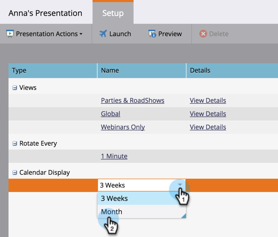

# Personnaliser une présentation {#customize-a-presentation}

Configurez votre présentation du calendrier pour qu’elle reflète les objectifs et les activités qui comptent le plus pour votre équipe.

>[!NOTE]
>
>**Disponibilité**
>
>Tous les clients n’ont pas acheté cette fonctionnalité. Contactez votre représentant commercial pour plus de détails.

>[!PREREQUISITES]
>
>* [Créer des ](/help/marketo/product-docs/core-marketo-concepts/marketing-calendar/calendar-hd/create-a-custom-goal.md) objectifs de Liste  [intelligente ou des objectifs personnalisés](/help/marketo/product-docs/core-marketo-concepts/marketing-calendar/calendar-hd/create-a-smart-list-goal.md)
   >
   >
* [Créer une présentation](/help/marketo/product-docs/core-marketo-concepts/marketing-calendar/calendar-hd/create-a-presentation.md)

## Choix des Vues {#choosing-the-views}

Effectuez un cycle Presentations à l’aide de différentes [définitions de filtre](/help/marketo/product-docs/core-marketo-concepts/marketing-calendar/working-with-the-calendar/filtering-the-marketing-calendar.md) que vous avez sélectionnées. Extrayez autant de vues que vous le souhaitez et personnalisez la fréquence.

1. Dans l’arborescence de droite, faites glisser les différentes vues que vous souhaitez faire pivoter dans votre présentation.

   

## Ajouter un objectif {#add-a-goal}

Presentations est le plus génial lorsqu&#39;il affiche les objectifs de votre équipe. Il vous suffit de faire glisser les différents [objectifs personnalisés](/help/marketo/product-docs/core-marketo-concepts/marketing-calendar/calendar-hd/create-a-custom-goal.md) ou [objectifs de liste intelligente](/help/marketo/product-docs/core-marketo-concepts/marketing-calendar/calendar-hd/create-a-smart-list-goal.md). Vous pouvez en utiliser jusqu&#39;à 10.

1. Dans l&#39;arborescence de droite, faites glisser les différents objectifs à afficher dans votre présentation.

   

## Définir la fréquence de rotation {#set-the-frequency-of-rotation}

Une fois que vous avez saisi les vues de votre choix dans la présentation, définissez la fréquence de rotation entre les différentes vues.

1. Cliquez sur **5 minutes** (il s’agit de la cadence par défaut).

   

1. Entrez une heure en minutes. Cliquez sur **Enregistrer**.

   >[!NOTE]
   >
   >Affichez une vue statique en cochant **Désactiver la rotation**.

   

## Définir l&#39;affichage du calendrier {#set-the-calendar-display}

L&#39;affichage du calendrier peut être défini sur une vue de 3 semaines ou mensuelle.

1. Sélectionnez la liste déroulante **Affichage du calendrier** et choisissez entre **3 semaines** ou un **mois**.

   

   Super ! Prêt à voir votre présentation ?

>[!TIP]
>
>Définissez une [image d’arrière-plan](/help/marketo/product-docs/core-marketo-concepts/marketing-calendar/calendar-hd/add-a-background-image-to-a-presentation.md) pour votre présentation. Nous suggérons des chatons ou des arcs-en-ciel.

## Prévisualisation a Présentation {#preview-a-presentation}

Une fois la présentation configurée, elle est prête à être prévisualisée et lancée.

1. Sélectionnez **Prévisualisation**.

   

   Ta-da ! Voici à quoi pourrait ressembler votre présentation.

   

   N&#39;aimez pas ce que vous voyez ? Retournez en arrière et utilisez différentes définitions de filtre pour créer la vue que vous aimez.

>[!MORELIKETHIS]
>
>* [Ajouter une image d’arrière-plan à une présentation](/help/marketo/product-docs/core-marketo-concepts/marketing-calendar/calendar-hd/add-a-background-image-to-a-presentation.md)
>* [Lancement d’une présentation](/help/marketo/product-docs/core-marketo-concepts/marketing-calendar/calendar-hd/launch-a-presentation.md)

