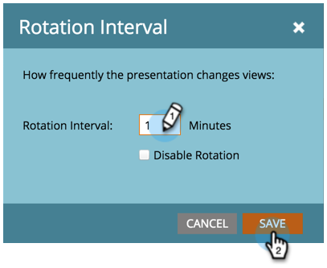

# Personnaliser une présentation {#customize-a-presentation}

Configurez la présentation de votre calendrier pour refléter les objectifs et les activités qui comptent le plus pour votre équipe.

>[!AVAILABILITY]
>
>
>Tous les utilisateurs de Marketo Engage n’ont pas acheté cette fonctionnalité. Pour plus d’informations, contactez l’équipe du compte Adobe (votre gestionnaire de compte).

>[!PREREQUISITES]
>
>* [Créer des objectifs personnalisés](/help/marketo/product-docs/core-marketo-concepts/marketing-calendar/calendar-hd/create-a-custom-goal.md){target="_blank"} ou [objectifs de liste dynamique](/help/marketo/product-docs/core-marketo-concepts/marketing-calendar/calendar-hd/create-a-smart-list-goal.md){target="_blank"}
>
>* [Créer une présentation](/help/marketo/product-docs/core-marketo-concepts/marketing-calendar/calendar-hd/create-a-presentation.md){target="_blank"}

## Choix des vues {#choosing-the-views}

Les présentations passent d&#39;une définition de filtre à l&#39;autre [définition](/help/marketo/product-docs/core-marketo-concepts/marketing-calendar/working-with-the-calendar/filtering-the-marketing-calendar.md){target="_blank"} au choix. Ajoutez autant de vues que vous le souhaitez et personnalisez la fréquence.

1. Dans l&#39;arborescence de droite, faites glisser les différents affichages que vous souhaitez faire pivoter dans votre présentation.

   

## Ajouter un objectif {#add-a-goal}

Les présentations sont plus efficaces lorsqu’elles affichent les objectifs de l’équipe. Faites glisser sur différents [objectifs personnalisés](/help/marketo/product-docs/core-marketo-concepts/marketing-calendar/calendar-hd/create-a-custom-goal.md){target="_blank"} ou [objectifs de liste dynamique](/help/marketo/product-docs/core-marketo-concepts/marketing-calendar/calendar-hd/create-a-smart-list-goal.md){target="_blank"}. Vous pouvez en utiliser jusqu’à 10.

1. Dans l&#39;arborescence de droite, faites glisser les différents objectifs que vous souhaitez afficher dans votre présentation.

   

## Régler la fréquence de rotation {#set-the-frequency-of-rotation}

Une fois les vues extraites, définissez la fréquence de rotation entre les différentes vues.

1. Cliquez sur **[!UICONTROL 5 minutes]** (cadence par défaut).

   

1. Entrez une heure en minutes. Cliquez sur **[!UICONTROL Enregistrer]**

   >[!NOTE]
   >
   >Affichez une vue statique en cochant **[!UICONTROL Désactiver la rotation]**.

   

## Définir l’affichage du calendrier {#set-the-calendar-display}

L’affichage du calendrier peut être remplacé par un affichage mensuel ou sur 3 semaines.

1. Sélectionnez le menu déroulant **[!UICONTROL Affichage du calendrier]** et choisissez entre **[!UICONTROL 3 semaines]** ou un **[!UICONTROL mois]**.

   

>[!TIP]
>
>Définissez une [image d’arrière-plan](/help/marketo/product-docs/core-marketo-concepts/marketing-calendar/calendar-hd/add-a-background-image-to-a-presentation.md){target="_blank"} pour votre présentation.

## Prévisualisation d&#39;une présentation {#preview-a-presentation}

Une fois la présentation configurée, elle est prête à être prévisualisée et lancée.

1. Sélectionnez **[!UICONTROL Aperçu]**.

   

   Voici à quoi pourrait ressembler votre présentation.

   

   Pour ajuster l’affichage, utilisez différentes définitions de filtre.

>[!MORELIKETHIS]
>
>* [Ajouter une image d&#39;arrière-plan à une présentation](/help/marketo/product-docs/core-marketo-concepts/marketing-calendar/calendar-hd/add-a-background-image-to-a-presentation.md){target="_blank"}
>* [Lancer une présentation](/help/marketo/product-docs/core-marketo-concepts/marketing-calendar/calendar-hd/launch-a-presentation.md){target="_blank"}
