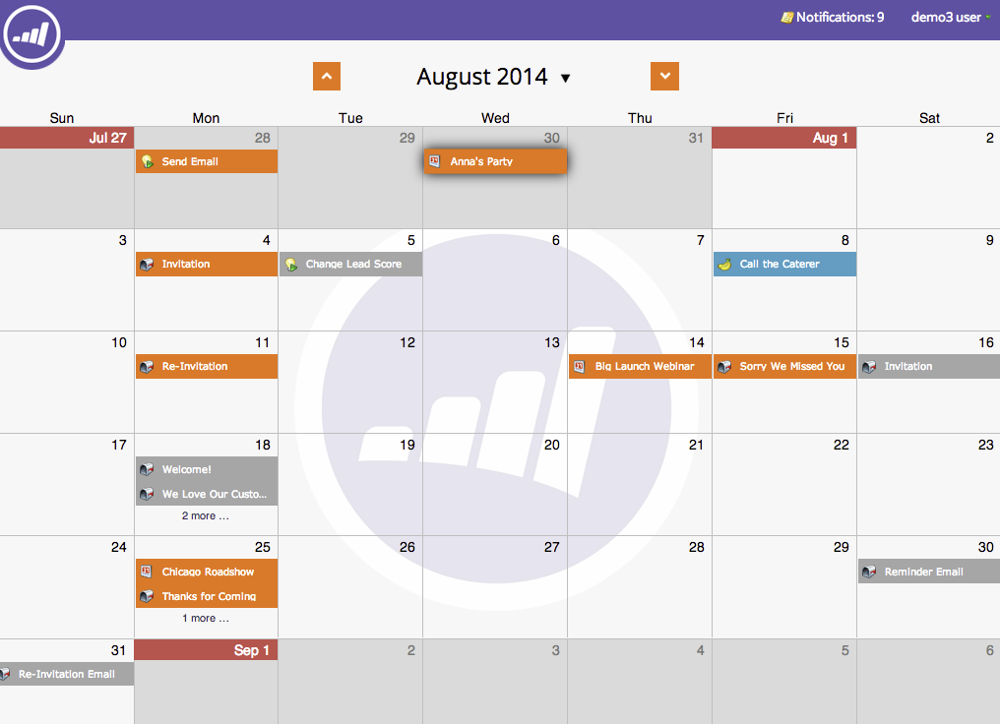

# Navigation dans le calendrier marketing {#navigating-the-marketing-calendar}

Découvrez comment naviguer dans le calendrier marketing.

>[!PREREQUISITES]
>
>Vérifiez que vous disposez d’une [licence de calendrier marketing](/help/marketo/product-docs/core-marketo-concepts/marketing-calendar/understanding-the-calendar/issue-revoke-a-marketing-calendar-license.md){target="_blank"}, sinon la mosaïque Calendrier marketing ne s’affichera pas dans Mon Marketo.

>[!NOTE]
>
>Les campagnes intelligentes récurrentes ne sont pas prises en charge dans le calendrier marketing.

1. Accédez au **Calendrier marketing**.

   

1. Il s’agit d’une vue d’ensemble des ressources planifiées dans votre instance Marketo.

   

## Changement entre les modes {#change-between-modes}

1. Cliquez sur les onglets **[!UICONTROL 3 semaines]** ou **[!UICONTROL mois]** pour basculer entre les modes.

   

## Utiliser la vue Agenda {#use-the-agenda-view}

La vue Agenda affiche toutes vos entrées sous forme de liste.

1. Cliquez sur le menu déroulant **[!UICONTROL Filtre]**.

   

1. Sélectionnez la vue **[!UICONTROL Agenda]**.

   

   Cette vue affiche tout ce qui est prévu.

   

## Naviguer dans le temps {#navigate-through-time}

Cliquez sur les boutons de navigation.

Vous pouvez également utiliser ces raccourcis clavier.

| Action | Raccourci clavier |
|---|---|
| Retour dans le temps | alt/opt + up |
| Transfert dans le temps | alt/opt + down |
| Accéder à « aujourd’hui » | alt/opt + t |

Ce sont les principes de base. Vous pouvez également personnaliser votre vue à l’aide de filtres.

>[!MORELIKETHIS]
>
>[Filtrer le calendrier marketing](/help/marketo/product-docs/core-marketo-concepts/marketing-calendar/working-with-the-calendar/filtering-the-marketing-calendar.md){target="_blank"}
