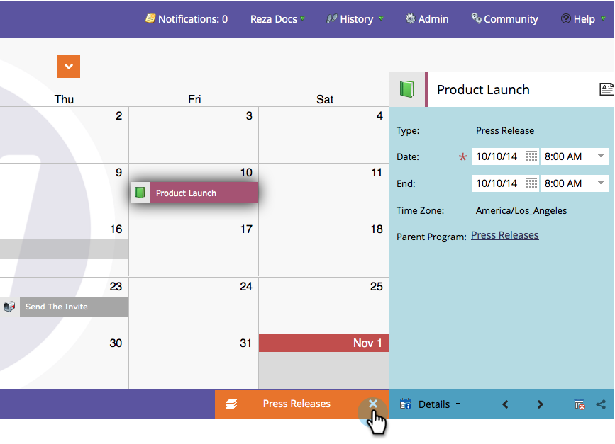

# Comprendre et activer l’orientation du programme {#understand-enable-program-focus}

Le calendrier marketing vous donne une vue d’ensemble des choses, mais il permet également certaines interactions. Vous pouvez [créer](/help/marketo/product-docs/core-marketo-concepts/marketing-calendar/working-with-the-calendar/create-entries-directly-in-the-marketing-calendar.md){target="_blank"}, [modifier](/help/marketo/product-docs/core-marketo-concepts/marketing-calendar/working-with-the-calendar/edit-entries-directly-in-the-marketing-calendar.md){target="_blank"}, [supprimer](/help/marketo/product-docs/core-marketo-concepts/marketing-calendar/working-with-the-calendar/delete-entries-directly-in-the-marketing-calendar.md){target="_blank"} et [confirmer](/help/marketo/product-docs/core-marketo-concepts/marketing-calendar/working-with-the-calendar/confirm-entries-directly-in-the-marketing-calendar.md){target="_blank"} des entrées. Pour interagir avec les entrées, vous devez d’abord vous concentrer sur un programme.

1. Accédez au **Calendrier marketing**.

   

1. Sélectionnez une entrée et cliquez sur **[!UICONTROL Afficher le focus du programme]**.

   

1. Le programme est désormais axé sur les « communiqués de presse ».

   

   >[!NOTE]
   >
   >Se concentrer sur un programme vous permet d’interagir uniquement avec les entrées qui lui appartiennent et de créer de nouvelles entrées qui seront hébergées par ce programme.

1. Une fois que vous avez terminé, libérez le focus pour interagir avec d’autres programmes ou entrées.

   

Suivez les liens ci-dessous pour savoir comment interagir avec les entrées.

>[!MORELIKETHIS]
>
>* [Créer des entrées directement dans le calendrier marketing](/help/marketo/product-docs/core-marketo-concepts/marketing-calendar/working-with-the-calendar/create-entries-directly-in-the-marketing-calendar.md){target="_blank"}
>* [Modifier des entrées directement dans le calendrier marketing](/help/marketo/product-docs/core-marketo-concepts/marketing-calendar/working-with-the-calendar/edit-entries-directly-in-the-marketing-calendar.md){target="_blank"}
>* [Supprimer des entrées directement dans le calendrier marketing](/help/marketo/product-docs/core-marketo-concepts/marketing-calendar/working-with-the-calendar/delete-entries-directly-in-the-marketing-calendar.md){target="_blank"}
>* [Confirmer les entrées directement dans le calendrier marketing](/help/marketo/product-docs/core-marketo-concepts/marketing-calendar/working-with-the-calendar/confirm-entries-directly-in-the-marketing-calendar.md){target="_blank"}
