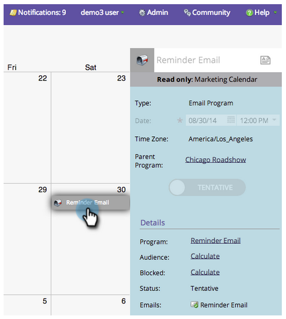

# Afficher les détails d’une entrée {#view-entry-details}

Lorsque vous affichez les détails d’une entrée dans le calendrier marketing, vous pouvez voir toutes sortes de choses intéressantes à propos d’une entrée.

1. Sélectionnez une entrée dans le calendrier.

   

1. Les entrées sont en lecture seule dans le calendrier marketing. Accédez au programme pour apporter des modifications.

   

>[!TIP]
>
>Essayez de cliquer avec le bouton droit sur les détails à droite. Vous pouvez afficher les menus pour parcourir ou faire apparaître les éditeurs. Bien, non ?
