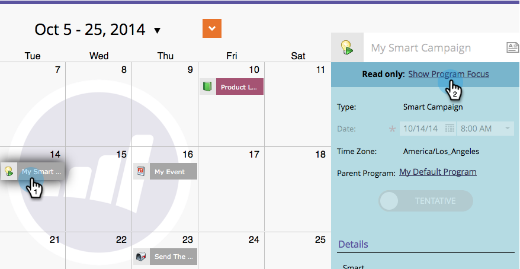

# Confirmer des entrées directement dans le calendrier marketing {#confirm-entries-directly-in-the-marketing-calendar}

Les campagnes intelligentes et les programmes de messagerie peuvent être créés en tant qu’entrées provisoires et doivent être confirmés pour que tout se produise réellement. Voici comment faire.

1. Accédez au **[!UICONTROL Calendrier]**.

   

1. Sélectionnez l’entrée à confirmer, puis cliquez sur **[!UICONTROL Afficher le focus du programme]**.

   

1. Continuez et confirmez l’entrée.

   

   La confirmation exécute une série de processus de validation et si tout s’extrait, l’entrée est confirmée.

   
