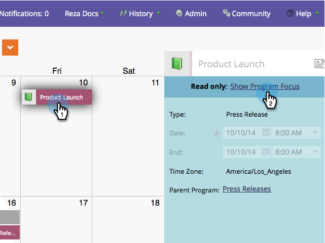
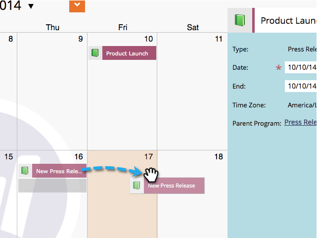
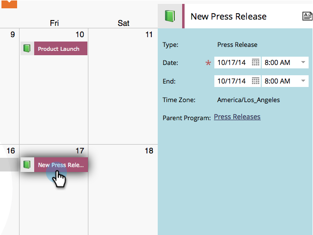
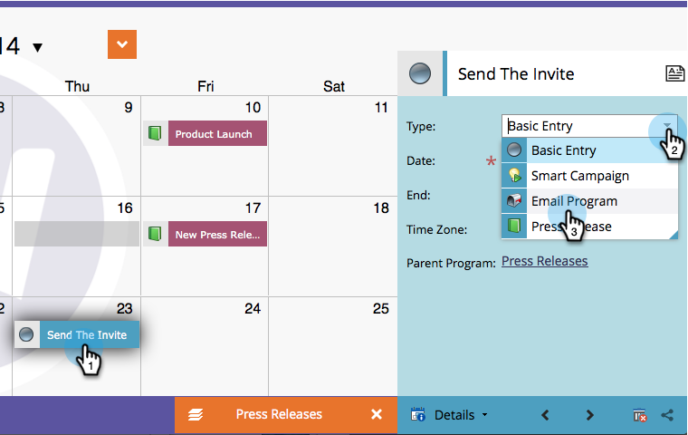

# Modifier des entrées directement dans le calendrier marketing {#edit-entries-directly-in-the-marketing-calendar}

Une fois en mode de ciblage du programme, vous pouvez rapidement apporter des modifications aux entrées du calendrier.

## Activer le focus du programme {#enable-program-focus}

1. Cliquez sur la mosaïque **[!UICONTROL Calendrier]**.

   

1. Sélectionnez une entrée qui appartient au programme sur lequel vous souhaitez placer le focus et cliquez sur **[!UICONTROL Afficher le focus du programme]**.

   

## Replanifier l&#39;entrée {#reschedule-entry}

1. Effectuez un glisser-déposer d’une entrée pour la replanifier.

   

## Modifier le nom de l&#39;entrée {#edit-entry-name}

1. Sélectionnez l’entrée à renommer.

   

1. Modifiez le nom de l’entrée.

   

   >[!TIP]
   >
   >Vous pouvez également modifier la description.
   >
   >

## Convertir le type d&#39;entrée {#convert-entry-type}

Après avoir rapidement mis au crayon vos entrées de base, vous pouvez les convertir dans leur forme finale.

1. Recherchez et sélectionnez l’entrée de base à convertir et modifiez son type.

   

## Modifier les détails d&#39;entrée {#edit-entry-details}

Vous pouvez rapidement accéder à différentes zones de vos entrées pour les modifier.

1. Cliquez avec le bouton droit de la souris sur une entrée et sélectionnez la zone à modifier.

   

Vous pouvez effectuer de nombreuses opérations directement à partir du calendrier marketing.

>[!MORELIKETHIS]
>
>[Supprimer des entrées directement dans le calendrier marketing](/help/marketo/product-docs/core-marketo-concepts/marketing-calendar/working-with-the-calendar/delete-entries-directly-in-the-marketing-calendar.md){target="_blank"}
