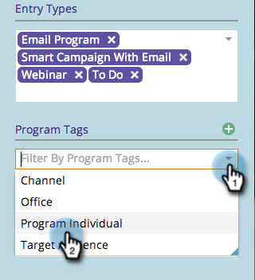

# Filtrage du calendrier marketing {#filtering-the-marketing-calendar}

Utilisez des types d’entrée, des balises de programme ou des espaces de travail pour filtrer les informations affichées dans le calendrier.

1. Cliquez sur la mosaïque **[!UICONTROL Calendrier]**.

1. Cliquez sur le menu déroulant **[!UICONTROL Type d’entrée]**.

   >[!NOTE]
   >
   >Les types d’entrée par défaut sont **[!UICONTROL E-mail]** **[!UICONTROL Programmes]** et **[!UICONTROL Campagnes intelligentes avec e-mail]**.

   

1. Choisissez d’autres types d’entrée à ajouter à votre filtre.

   

   >[!TIP]
   >
   >Pour obtenir une description des types de saisie standard, voir [Types de saisie de la vue Programme](/help/marketo/product-docs/core-marketo-concepts/programs/program-schedule-view/program-schedule-view-entry-types.md){target="_blank"}.

1. Sélectionnez les balises de programme qui vous intéressent.

   

1. Sélectionnez la valeur de la balise.

   

   Seules les entrées qui correspondent au filtre défini seront désormais visibles.

   >[!NOTE]
   >
   >[Enregistrer une définition de filtre dans le calendrier marketing](/help/marketo/product-docs/core-marketo-concepts/marketing-calendar/working-with-the-calendar/saving-a-filter-definition-in-the-marketing-calendar.md){target="_blank"}
