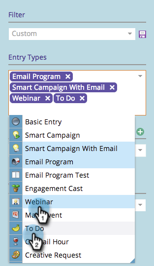

# Filtrage du calendrier marketing {#filtering-the-marketing-calendar}

Utilisez les types d’entrée, les balises de programme ou les espaces de travail pour filtrer les informations affichées dans le calendrier.

1. Accédez au calendrier.

1. Cliquez sur le bouton **Type d’entrée** menu déroulant.

   >[!NOTE]
   >
   >Les types d’entrée par défaut sont les suivants : **Email** **Programmes** et **Smart** **Campagnes** **avec** **Email**.

   

1. Sélectionnez d’autres types d’entrée que vous souhaitez voir dans votre filtre.

   

   >[!TIP]
   >
   >Pour obtenir des descriptions des types d’entrée standard, extrayez le [Types d’entrée de la vue de programme](/help/marketo/product-docs/core-marketo-concepts/programs/program-schedule-view/program-schedule-view-entry-types.md).

1. Sélectionnez les balises de programme qui vous intéressent.

   

1. Sélectionnez la valeur de balise.

   

   Super ! Désormais, seules les entrées qui s’appliquent au filtre que vous venez de définir s’affichent.

   >[!NOTE]
   >
   >[Enregistrement d’une définition de filtre dans le calendrier marketing](/help/marketo/product-docs/core-marketo-concepts/marketing-calendar/working-with-the-calendar/saving-a-filter-definition-in-the-marketing-calendar.md)
