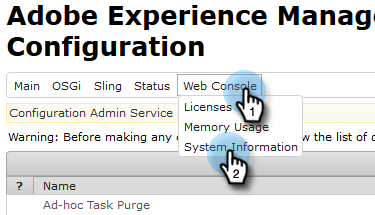
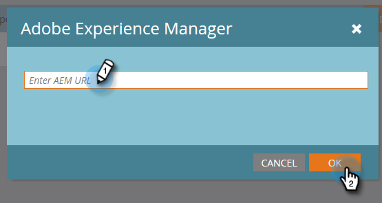

# Configuration de l’intégration Adobe Experience Manager {#configuring-adobe-experience-manager-integration}

Configurez AEM afin que vous puissiez accéder à, sélectionner et importer AEM ressources dans le studio de création de Marketo.

>[!NOTE]
>
>**Autorisations d’administrateur requises**

>[!CAUTION]
>
>Actuellement, cette fonctionnalité n’est entièrement prise en charge que dans Firefox. Il n’est pas pris en charge dans Safari et peut ne pas fonctionner dans la dernière version de Chrome (v. 80), selon vos paramètres de cookie SameSite.

1. Accédez au Adobe Experience Manager (l’URL est spécifique à votre société).

   

1. Vous pouvez vous connecter avec un Adobe ou vous connecter localement. Dans cet exemple, nous allons nous connecter localement.

   

1. Dans **Outils**, cliquez sur **Opérations** et sélectionnez **Console Web**.

   

1. Dans votre navigateur, recherchez (ctrl+f sous Windows, cmd+f sous Mac) &quot;Adobe Granite Cross-Origine Resource Sharing Policy&quot; (Stratégie de partage des ressources entre les  de granit d’).

   

1. Cliquez sur le signe **+** à droite.

   

1. Dans la zone de texte **Origines autorisées (Regexp)**, tapez &quot;https://.*\.marketo\.com&quot; (sans guillemets) et cliquez sur **Enregistrer**.

   

1. Dans l&#39;en-tête en haut de la page, cliquez sur **Console Web** et sélectionnez **Informations système**.

   

1. Sous Informations sur le serveur, cliquez sur le bouton **Redémarrer**.

   

1. Cliquez sur **OK** pour confirmer.

   

1. Dans Marketo Classic, cliquez sur **Admin**.

   

1. Sous Intégration, sélectionnez **Adobe Experience Manager**.

   

1. Cliquez sur **Modifier**.

   

1. Saisissez l’URL de votre AEM et cliquez sur **OK**.

   

   Vous êtes toutes prêtes ! Vous pouvez désormais [importer des actifs AEM dans Design Studio en Marketo Sky](http://help.marketo.com/hc/en-us/articles/360036765993).

