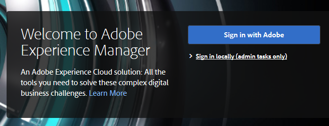
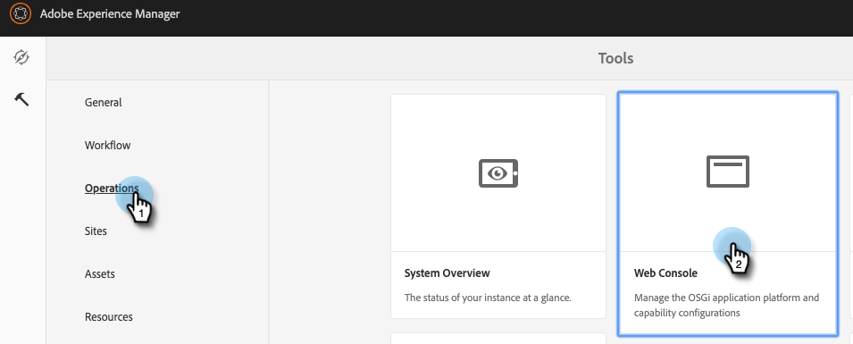
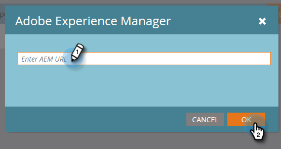

# Configuration de l’intégration d’Adobe Experience Manager {#configuring-adobe-experience-manager-integration}

Configurez Adobe Experience Manager (AEM) pour pouvoir accéder aux ressources AEM, les sélectionner et les importer dans Marketo Engage Design Studio.

>[!NOTE]
>
>**Autorisations d’administration requises**

>[!IMPORTANT]
>
>* Cette intégration fonctionne uniquement avec les implémentations On-Premise d’AEM et n’est pas prise en charge pour les implémentations AEM Cloud Service.
>
>* Actuellement, cette fonctionnalité n’est entièrement prise en charge que dans Firefox. Il n’est pas pris en charge dans Safari et peut ne pas fonctionner dans la dernière version de Chrome, selon les paramètres de vos cookies SameSite.

1. Accédez au Adobe Experience Manager (l’URL est spécifique à votre société).

   

1. Vous pouvez vous connecter à l’aide d’Adobe ou vous connecter localement. Cet exemple utilise la connexion locale.

   

1. Dans **[!UICONTROL Outils]**, cliquez sur **[!UICONTROL Opérations]** et sélectionnez **[!UICONTROL Console web]**.

   

1. Dans votre navigateur, recherchez « [!UICONTROL Politique de partage de ressources entre origines multiples Adobe Granite ] » (ctrl+f sous Windows, cmd+f sous Mac).

   

1. Cliquez sur le signe **+** à droite.

   

1. Dans la zone de texte **[!UICONTROL Origines autorisées (Regexp)]**, saisissez `https://.*\.marketo\.com` et cliquez sur **[!UICONTROL Enregistrer]**.

   

1. Dans l’en-tête situé en haut de la page, cliquez sur **[!UICONTROL Console web]** et sélectionnez **[!UICONTROL Informations système]**.

   

1. Sous Server Information, cliquez sur le bouton **[!UICONTROL Redémarrer]**.

   

1. Cliquez sur **[!UICONTROL OK]** pour confirmer.

   

1. Dans Marketo Engage, cliquez sur **[!UICONTROL Admin]**.

   

1. Sous Intégration, sélectionnez ****.

   

1. Cliquez sur **[!UICONTROL Modifier]**.

   

1. Saisissez l’URL d’AEM, puis cliquez sur **[!UICONTROL OK]**.

   
