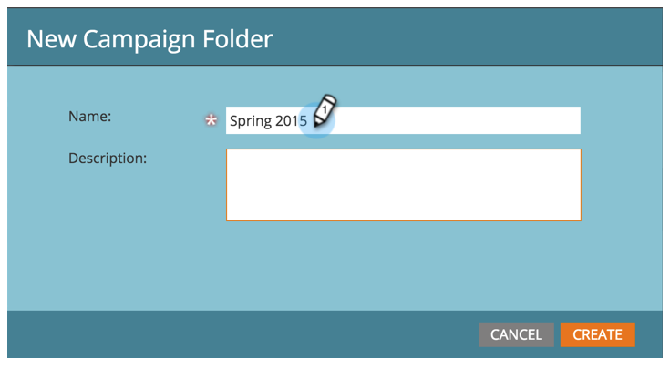

# Créer un dossier de campagne {#create-new-campaign-folder}

Les dossiers Campaign vous aident à garder un espace de travail propre. Pour commencer, procédez comme suit.

1. Accédez à **[!UICONTROL Activités marketing]**.

   

1. Sélectionnez **[!UICONTROL Nouveau]**.

   

1. Sélectionnez **[!UICONTROL Nouveau dossier de campagne]**.

   

1. Saisissez un **[!UICONTROL Nom]** pour le dossier de campagne.

   

1. Facultatif : saisissez une **[!UICONTROL Description]** puis cliquez sur **[!UICONTROL Créer]**.

   >[!TIP]
   >
   >Les descriptions sont destinées aux autres utilisateurs de l’abonnement. Vos clients ne verront pas ce message.

   

   Le dossier des campagnes apparaît dans l’arborescence.

   

   Désormais, lors de la [création d’un programme](/help/marketo/product-docs/core-marketo-concepts/programs/creating-programs/create-a-program.md), ce dossier de campagne apparaît comme une option.

>[!MORELIKETHIS]
>
>* [Créer un programme](/help/marketo/product-docs/core-marketo-concepts/programs/creating-programs/create-a-program.md)
>* [Créer une campagne intelligente](/help/marketo/product-docs/core-marketo-concepts/smart-campaigns/creating-a-smart-campaign/create-a-new-smart-campaign.md)
