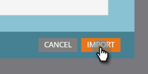

# Importation de ressources avec Adobe Experience Manager {#importing-assets-with-adobe-experience-manager}

Le Sélecteur de ressources permet aux clients de Marketing d’accéder à des fichiers, de les sélectionner et de les importer AEM dans Design Studio de Marketo. **Les autorisations d’administrateur sont requises**.

>[!NOTE]
>
>**Disponibilité**
>
>Tous les clients n’ont pas acheté cette fonctionnalité. Pour plus d’informations, contactez votre responsable de succès client.

>[!PREREQUISITES]
>
>Vérifiez que vous avez déjà effectué la configuration [AEM](https://docs.marketo.com/x/FwPLAQ).

>[!CAUTION]
>
>Actuellement, cette fonctionnalité n’est entièrement prise en charge que dans Firefox. Il n’est pas pris en charge dans Safari et peut ne pas fonctionner dans la dernière version de Chrome (v. 80), selon vos paramètres de cookie SameSite.

1. Cliquez sur **Design Studio**.

   

1. Cliquez sur la liste déroulante Nouveau et sélectionnez **Importer à partir de Adobe Experience Manager**.

   

1. Sélectionnez le dossier dans lequel vos images seront enregistrées.

   

1. Connectez-vous à Adobe Experience Manager (si vous ne l&#39;avez pas déjà fait).

   

1. Sélectionnez votre dossier. Sélectionnez ensuite les images de votre choix en cliquant sur la miniature (vous pouvez choisir jusqu’à 10). Cliquez sur **Sélectionner** lorsque vous avez terminé.

   

   >[!NOTE]
   >
   >La taille des images ne doit pas dépasser 100 Mo.

1. Cliquez sur **Importer** pour terminer le processus.

   

   Et c&#39;est tout ! Cliquez sur **Fermer** pour revenir à Design Studio.

   

## Éléments à noter {#things-to-note}

Marketo prend actuellement en charge les versions 6.4 et 6.5 de Adobe Experience Manager.

Tous les utilisateurs de votre instance pourront vue/accéder aux images importées.

Les images ne sont pas automatiquement mises à jour. Si une image que vous avez importée dans Marketo Design Studio est mise à jour dans AEM, vous devez la réimporter manuellement dans Marketo.
