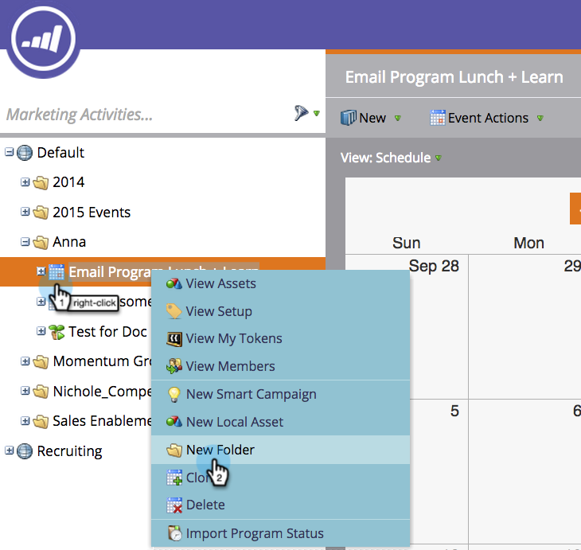

# Présentation des dossiers {#understanding-folders}

Les dossiers d’un programme peuvent être utilisés pour organiser vos campagnes et ressources intelligentes. Il s’agit de dossiers [de](create-new-campaign-folder.md)campagne différents.

## Création d’un dossier {#create-a-folder}

1. Accédez à la zone Activités **** marketing.

   

1. Cliquez avec le bouton droit sur un programme et sélectionnez **Nouveau dossier**.

   

1. Nommez le nouveau dossier et appuyez sur **Entrée**.

   

Super ! Vous disposez maintenant d’un nouveau dossier pour stocker vos ressources locales.

## Renommer un dossier {#rename-a-folder}

C&#39;est bon de changer d&#39;avis.

1. Cliquez avec le bouton droit de la souris sur le dossier et sélectionnez **Renommer le dossier**.

   

1. Saisissez un nouveau nom et appuyez sur **Entrée**.

   

   Et Volia ! Le dossier porte un nouveau nom.

## Suppression d’un dossier {#delete-a-folder}

>[!NOTE]
>
>Assurez-vous que le dossier est vide avant de le supprimer.

1. Cliquez avec le bouton droit de la souris sur le dossier et sélectionnez **Supprimer le dossier**.

   

   Dossier Adios !

## Archiver un dossier {#archive-a-folder}

Dans Marketo, vous pouvez convertir des dossiers existants en dossiers d’archives. Les dossiers d’archives existent dans Marketing Activités, Database et Design Studio.

Lorsque vous archivez un dossier :

* Le dossier et les ressources ne sont plus visibles dans les résultats de la recherche. Si vous recherchez un Programme ou un Événement se trouvant dans un dossier archivé, les résultats renvoient une vue réduite du dossier archivé.
* Les ressources du dossier n’apparaissent plus dans la suggestion automatique.
* Les modèles archivés ne sont pas disponibles lors de la création d’un courrier électronique ou d’un landing page dans Design Studio.
* Impossible d&#39;utiliser les pages archivées dans les groupes de tests de landing page

Fonctionnalités qui **ne changent pas** lors de l’archivage :

* La recherche globale recherche toujours les résultats dans les dossiers archivés
* Une ressource en cours d’utilisation continuera à fonctionner même après son archivage.
* Vous pouvez utiliser un filtre pour sélectionner des fichiers archivés à utiliser dans les rapports.
* Les fichiers archivés ne sont pas désactivés. Ils doivent également être désactivés si vous souhaitez qu’ils cessent de fonctionner.

