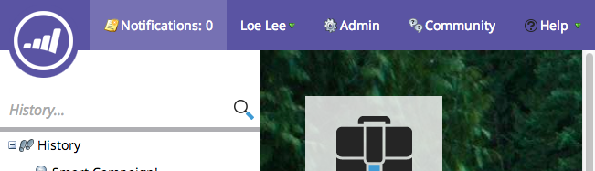

# Présentation des notifications {#understanding-notifications}

Les notifications vous permettent de rester informé des événements système survenant dans votre abonnement Marketing. Par exemple, les notifications d’échec de Campaign vous informent sur les erreurs de vos campagnes actives et les notifications de synchronisation de la gestion de la relation client vous signalent les problèmes critiques détectés avec la synchronisation de la gestion de la relation client, tels que des autorisations incorrectes ou la synchronisation en cours de désactivation.

## Aperçu {#overview}

1. Les nouvelles notifications s’affichent en haut à droite de Marketo.

   

1. Cliquez sur Notifications pour vue toutes vos notifications.

   

## S&#39;abonner aux notifications {#subscribe-to-notifications}

Vous pouvez vous abonner à des notifications pour les recevoir dans votre courrier électronique.

1. Accédez à Notifications et cliquez sur S’abonner.

1. Sélectionnez le type de notification et saisissez la ou les adresses électroniques auxquelles vous souhaitez envoyer les notifications.

>[!NOTE]
>
>Dans certains cas, une notification fournit un lien &quot;Voir la liste complète&quot; pour télécharger un fichier CSV (valeurs séparées par des virgules), par exemple, le fichier Erreurs Microsoft Dynamics Sync. Marketo conserve ces fichiers CSV pendant 30 jours. Si vous tentez de télécharger le fichier après 30 jours, vous obtiendrez une erreur 404.

>[!TIP]
>
>Souhaitez-vous vous désabonner des courriels de notification ? Pas de problème. Il vous suffit de cliquer sur le lien **se désabonner des notifications** au bas du courrier électronique.

