# Enregistrer des personnes dans votre événement à partir de votre tablette {#check-people-into-your-event-from-your-tablet}

Lorsque les gens se présentent à votre événement, vous pouvez trouver leurs informations sur l&#39;application. Après l’enregistrement, ils sont promus au statut Participant lorsque vous effectuez une synchronisation avec Marketo.

>[!IMPORTANT]
>
>Le 2 octobre 2023, Adobe a supprimé l’application d’événements Marketo de tous les magasins d’applications. Si l’application est déjà installée sur votre tablette ou votre appareil mobile, vous pouvez continuer à l’utiliser pour le moment. Une fois votre instance Marketo Engage migrée vers Adobe Identity pour l’authentification de Marketo, vous ne pourrez plus accéder à l’application. [En savoir plus](https://nation.marketo.com/t5/product-discussions/marketo-events-app-and-marketo-moments-app-end-of-life/m-p/340712/highlight/true#M193869){target="_blank"}.

L’application fonctionne de la même manière sur [!DNL iPad] et [!DNL Android], à l’exception de légères différences de mise en page et de conception.

>[!PREREQUISITES]
>
>* Créez un événement dans Marketo et renseignez-le avec des personnes invitées et enregistrées.

## Enregistrer les invités enregistrés {#check-in-registered-guests}

1. Appuyez sur l’icône de l’application sur votre tablette [!DNL iPad] ou [!DNL Android].

1. Appuyez sur **[!UICONTROL Connexion]** pour lancer l’application Événement Marketo.

   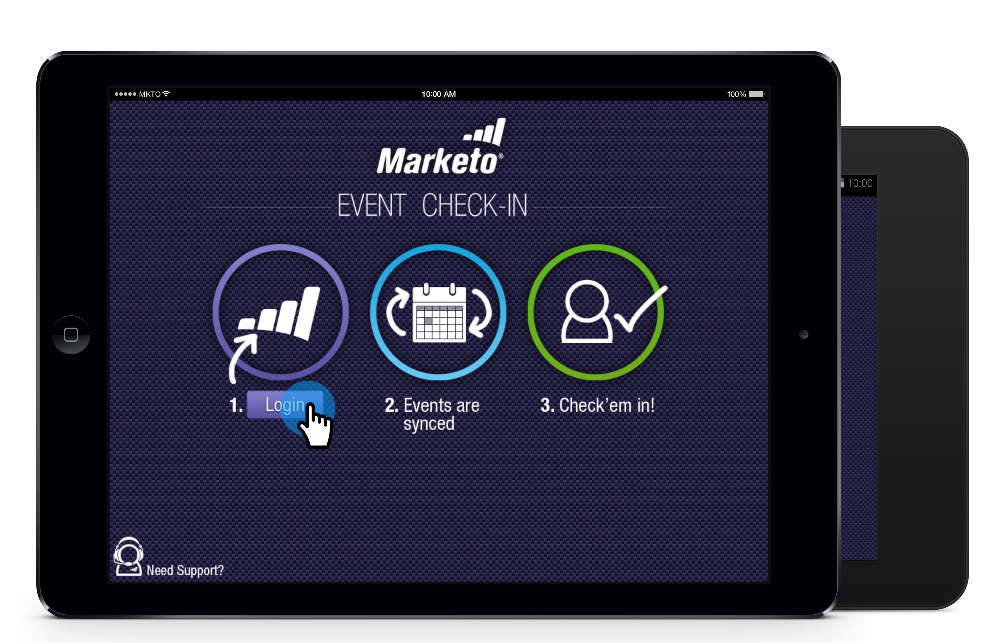

1. Saisissez votre nom d’utilisateur et votre mot de passe Marketo, puis cliquez sur **[!UICONTROL Connexion]**.

   >[!NOTE]
   >
   >Vous devez disposer d&#39;un rôle avec un accès à la base de données pour voir les personnes dans l&#39;application.

1. Sélectionnez un **[!UICONTROL Événement]**.

   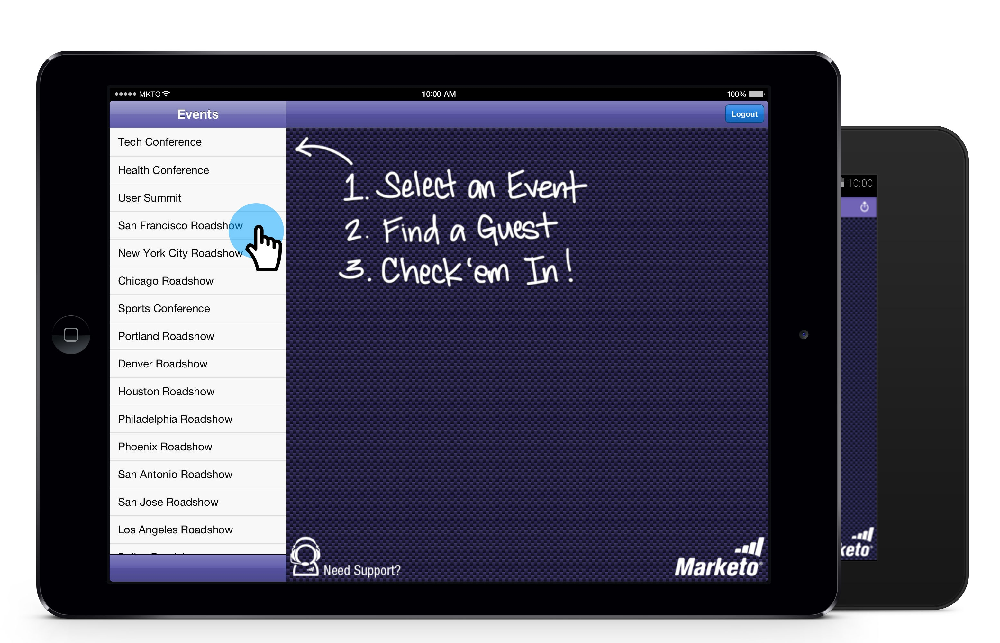

   >[!TIP]
   >
   >Seuls les programmes d’événement (à l’exception des webinaires) planifiés une semaine avant et une semaine après la date d’aujourd’hui s’affichent.

1. Sur l’écran d’accueil, recherchez Invités enregistrés . Pour trouver une personne dans la liste, vous pouvez :

   * Défilement pour trouver un nom
   * Saisir un nom dans le champ de recherche
   * Accédez à une lettre initiale spécifique du nom en appuyant dessus sur le côté droit de la liste

   >[!NOTE]
   >
   >Le processus est le même sur [!DNL iPad] et [!DNL Android], mais les écrans diffèrent et les éléments peuvent se trouver à des emplacements différents. Cet article présente l’interface [!DNL iPad]. Comparez l’écran [!DNL Android] de cette section à titre de référence.

   **[!DNL iPad]**

   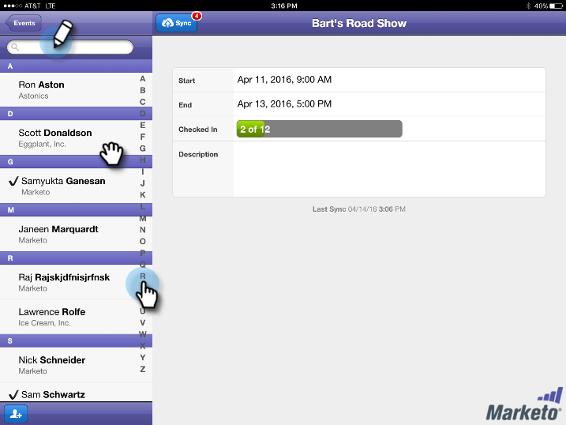

   **[!DNL Android]**

   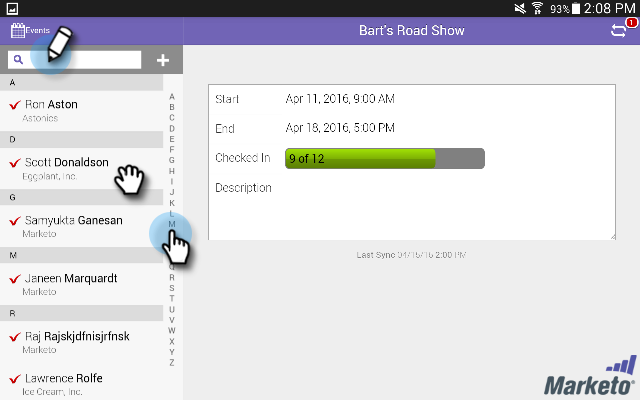

1. Appuyez sur le nom sélectionné, puis sur l’enregistrement de la personne, appuyez sur **[!UICONTROL Archiver]**.

   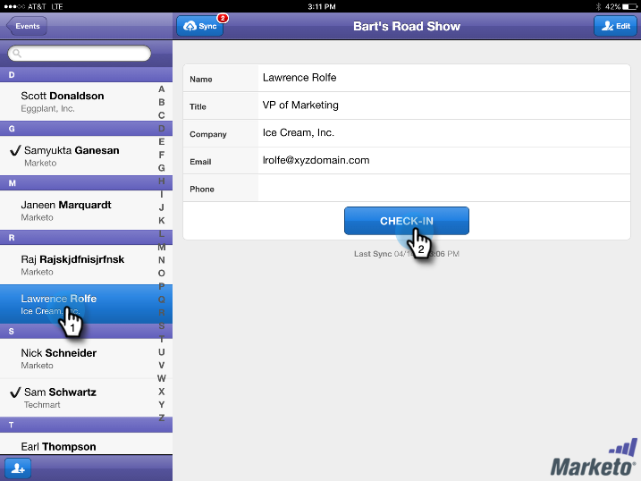

L’invité possède désormais le statut Terminé et reçoit une coche. L’enregistrement de personne est mis à jour lorsque vous effectuez une synchronisation avec Marketo. Le compteur rouge sur le bouton Synchroniser s’incrémente pour afficher le nombre d’archivages depuis la dernière synchronisation avec Marketo. Le bouton Synchroniser a un aspect différent et se trouve à un emplacement différent pour [!DNL iPad] et [!DNL Android] :

**[!DNL iPad]**

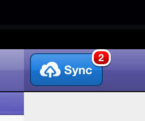

**[!DNL Android]**

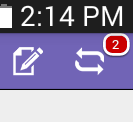

>[!TIP]
>
>Si une personne est invitée mais ne s’est pas enregistrée, vous pouvez rechercher le nom en cliquant sur **[!UICONTROL Rechercher sur le serveur]**, sous la zone de recherche. Le statut Invité passe à **[!UICONTROL Participé]** pour l’événement.

## Créer une nouvelle personne sur la tablette {#create-a-new-person-on-the-tablet}

Vous pouvez ajouter manuellement des invités qui ne sont pas des personnes existantes dans votre base de données Marketo. Ils seront automatiquement archivés et ajoutés à votre base de données lors de la synchronisation avec Marketo.

1. Cliquez sur **[!UICONTROL Ajouter]**.

   **[!DNL iPad]**

   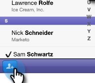

   **[!DNL Android]**

   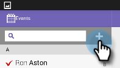

1. Renseignez autant de champs d’informations de base que possible et appuyez sur **[!UICONTROL Terminé]**.

   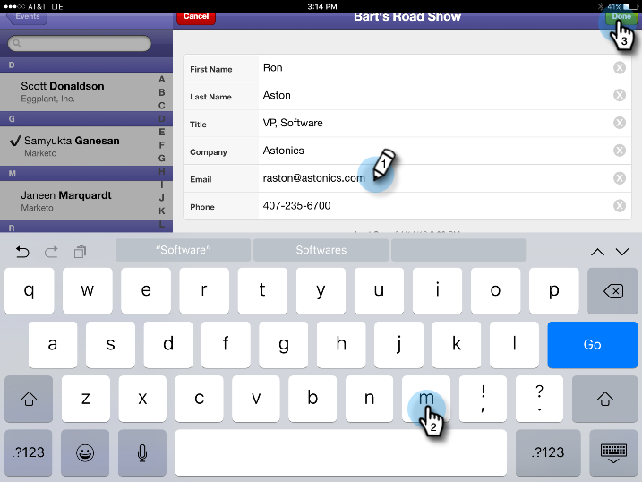

   >[!NOTE]
   >
   >Seuls les champs existants sont disponibles. Impossible de créer les champs personnalisés.

   >[!CAUTION]
   >
   >Vérifiez à nouveau l’adresse e-mail. D’autres champs peuvent être corrigés ultérieurement, mais l’adresse e-mail est la méthode principale pour contacter l’invité.

La nouvelle personne est enregistrée comme étant connectée à votre événement et sera ajoutée à la base de données Marketo avec le statut Terminé lorsque vous effectuez une synchronisation avec Marketo.

## Inverser un enregistrement {#reverse-a-check-in}

Si vous avez archivé une personne par erreur, _avant la synchronisation avec Marketo_, vous pouvez annuler le statut [!UICONTROL Terminé].

1. Appuyez sur le nom dans la liste, puis sur **[!UICONTROL Annuler]** dans l’enregistrement de personne.

   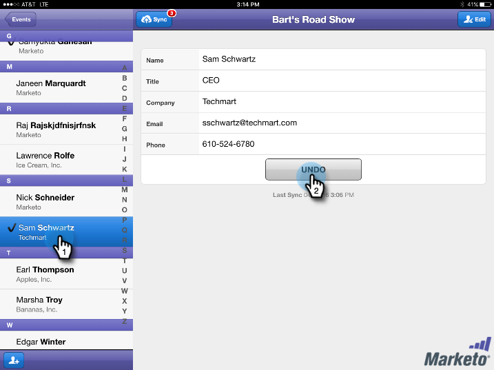

## Modifier un enregistrement de personne lors de l’enregistrement {#edit-a-person-record-at-check-in}

Vous pouvez ajouter et modifier des informations sur les invités à l’événement.

1. Appuyez sur le nom dans la liste des personnes, puis sur **[!UICONTROL Modifier]**.

   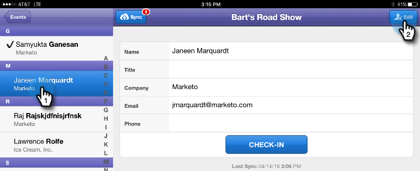

1. Modifiez et ajoutez des informations aux champs, puis appuyez sur **[!UICONTROL Terminé]**.

   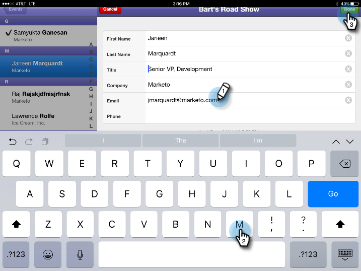

   >[!NOTE]
   >
   >Dans [!DNL Android], le bouton **[!UICONTROL Terminé]** peut être masqué. Faites défiler la page vers le bas pour le trouver.

Les informations sont mises à jour lorsque vous synchronisez l’application avec Marketo.

## Synchroniser l’application avec Marketo {#sync-the-app-with-marketo}

L’application Marketo Events fonctionne indépendamment jusqu’à ce que vous resynchronisiez votre activité avec la base de données Marketo. Il est préférable de synchroniser le plus tôt possible après le dernier enregistrement. Votre tablette doit être connectée à Internet.

>[!CAUTION]
>
>Après la synchronisation, il n’est pas possible d’annuler un enregistrement à partir de l’application.

1. Sur votre tablette, ouvrez l’application et accédez à votre événement.

1. Appuyez sur **[!UICONTROL Synchroniser]**.

   Votre événement est mis à jour avec de nouveaux enregistrements dans la base de données Marketo. Le compteur rouge sur le bouton Synchroniser se décoche jusqu&#39;à ce que vous consigniez quelqu&#39;un d&#39;autre.

   Pour des raisons de sécurité, vous devez quitter l’application Marketo Events une fois la synchronisation terminée.

## Utilisation d’un accès Internet limité {#working-with-limited-internet-access}

Certains endroits ont un mauvais accès à Internet. Vous avez besoin d’une bonne connexion vers :

* Télécharger et installer l’application
* Se connecter
* Sélectionner un événement
* Synchroniser l’application avec Marketo

Si vous êtes préoccupé par l&#39;accès à Internet sur le site, vous pouvez vous connecter à l&#39;application Marketo Events et sélectionner votre événement à l&#39;avance, à un emplacement disposant d&#39;un accès Internet fort. De cette manière, vous pouvez toujours utiliser l’application hors ligne. Ensuite, lorsque vous retrouvez une connexion Internet, synchronisez immédiatement avec la base de données Marketo.

>[!TIP]
>
>S’il n’existe aucune connexion Internet, une nouvelle personne peut toujours être créée pour une personne qui s’enregistre. Il se réconciliera avec la personne existante lorsque vous synchroniserez l’application.

>[!NOTE]
>
>L’application vous déconnecte automatiquement après huit heures d’inactivité.
