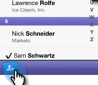
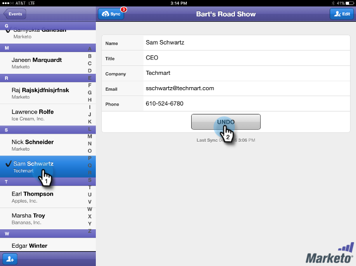

# Archivage des personnes dans votre événement à partir de votre tablette {#check-people-into-your-event-from-your-tablet}

Lorsque des personnes se présentent à votre événement, vous pouvez trouver leurs informations dans l’application. Après l’archivage, ils sont promus au statut Participant lorsque vous vous synchronisez avec Marketo.

>[!IMPORTANT]
>
>Le 2 octobre 2023, Adobe a supprimé l’application Marketo Events de toutes les boutiques d’applications. Si l’application est déjà installée sur votre tablette/périphérique mobile, vous pouvez continuer à l’utiliser pour le moment. Une fois votre instance de Marketo Engage migrée vers Adobe Identity pour l’authentification de Marketo, vous ne pourrez plus accéder à l’application. [En savoir plus](https://nation.marketo.com/t5/product-discussions/marketo-events-app-and-marketo-moments-app-end-of-life/m-p/340712/highlight/true#M193869){target="_blank"}.

L’application fonctionne de la même manière sur [!DNL iPad] et [!DNL Android], à l’exception des différences mineures de mise en page et de conception.

>[!PREREQUISITES]
>
>* Créez un événement dans Marketo et renseignez-le avec des personnes invitées et enregistrées.

## Archivage des invités enregistrés {#check-in-registered-guests}

1. Appuyez sur l’icône de l’application sur votre tablette [!DNL iPad] ou [!DNL Android].

1. Appuyez sur **[!UICONTROL Login]** pour lancer l’application Marketo Event.

   

1. Saisissez votre nom d’utilisateur et votre mot de passe Marketo, puis cliquez sur **[!UICONTROL Login]**.

   >[!NOTE]
   >
   >Vous devez disposer d’un rôle avec accès à la base de données pour voir les personnes dans l’application.

1. Sélectionnez un **[!UICONTROL événement]**.

   

   >[!TIP]
   >
   >Seuls les programmes d’événement (à l’exception des webinaires) planifiés une semaine avant et une semaine après la date d’aujourd’hui s’affichent.

1. Sur l’écran Accueil , recherchez les invités enregistrés . Pour trouver une personne dans la liste, vous pouvez :

   * Faire défiler pour trouver un nom
   * Saisissez un nom dans le champ de recherche.
   * Accédez à une lettre initiale spécifique du nom en appuyant dessus sur la partie droite de la liste.

   >[!NOTE]
   >
   >Le processus est le même sur [!DNL iPad] et [!DNL Android], mais les écrans diffèrent et les éléments peuvent se trouver à des emplacements différents. Cet article présente l’interface de [!DNL iPad]. Comparez l’écran [!DNL Android] de cette section à titre de référence.

   **[!DNL iPad]**

   

   **[!DNL Android]**

   

1. Appuyez sur le nom sélectionné, puis, sur l’enregistrement de la personne, appuyez sur **[!UICONTROL Check-in]**.

   

L’invité dispose désormais du statut Participant et reçoit une coche. L’enregistrement de personne est mis à jour lors de la synchronisation avec Marketo. Le compteur rouge sur le bouton Synchroniser s’incrémente pour afficher le nombre d’enregistrements depuis la dernière synchronisation avec Marketo. Le bouton Synchroniser a un aspect différent et se trouve à un autre emplacement pour [!DNL iPad] et [!DNL Android] :

**[!DNL iPad]**

**[!DNL Android]**

>[!TIP]
>
>Si une personne est invitée mais ne s’est pas inscrite, vous pouvez rechercher le nom en cliquant sur **[!UICONTROL Rechercher sur le serveur]**, juste sous la zone de recherche. L’état Invité passe à **[!UICONTROL Participé]** pour l’événement.

## Création d’une personne sur la tablette {#create-a-new-person-on-the-tablet}

Vous pouvez ajouter manuellement des invités qui ne sont pas des personnes existantes dans votre base de données Marketo. Ils seront automatiquement archivés et ajoutés à votre base de données lors de la synchronisation avec Marketo.

1. Cliquez sur **[!UICONTROL Ajouter]**.

   **[!DNL iPad]**

   

   **[!DNL Android]**

   

1. Complétez autant de champs d’informations de base que possible et appuyez sur **[!UICONTROL Terminé]**.

   

   >[!NOTE]
   >
   >Vous ne pouvez utiliser que les champs existants. Vous ne pouvez pas en créer des personnalisés.

   >[!CAUTION]
   >
   >Vérifiez deux fois l&#39;adresse email. D’autres champs peuvent être corrigés ultérieurement, mais l’adresse électronique est la méthode principale pour contacter l’invité.

La nouvelle personne est enregistrée comme archivée dans votre événement et sera ajoutée à la base de données Marketo avec le statut Participant lors de la synchronisation avec Marketo.

## Reverse d’une archivage {#reverse-a-check-in}

Si vous avez archivé une personne par erreur, _avant de vous synchroniser avec Marketo_, vous pouvez inverser l’état Participant .

1. Appuyez sur le nom dans la liste, puis, dans l’enregistrement de la personne, appuyez sur **[!UICONTROL Annuler]**.

   

   Tout est réparé !

## Modification d’un enregistrement de personne lors de l’archivage {#edit-a-person-record-at-check-in}

Vous pouvez ajouter et modifier des informations sur les invités, directement à l’événement !

1. Appuyez sur le nom dans la liste des personnes et appuyez sur **[!UICONTROL Modifier]**.

   

1. Modifiez et ajoutez des informations aux champs, puis appuyez sur **[!UICONTROL Terminé]**.

   

   >[!NOTE]
   >
   >Dans [!DNL Android], le bouton **[!UICONTROL Terminé]** peut être masqué. Faites défiler l’écran vers le bas pour le trouver.

Les informations sont mises à jour lorsque vous synchronisez l’application avec Marketo.

## Synchronisation de l’application avec Marketo {#sync-the-app-with-marketo}

L’application Marketo Events fonctionne indépendamment jusqu’à ce que vous resynchronisiez votre activité sur la base de données Marketo. Il est préférable de se synchroniser dès que possible après la dernière archivage. Votre tablette doit être connectée à Internet.

>[!CAUTION]
>
>Une fois la synchronisation effectuée, vous ne pouvez pas inverser l’archivage à partir de l’application.

1. Sur votre tablette, ouvrez l’application et accédez à votre événement.

1. Appuyez sur **[!UICONTROL Sync]**.

   Votre événement est mis à jour avec de nouveaux check-ins dans la base de données Marketo. Le compteur rouge sur le bouton Synchroniser s’efface, jusqu’à ce que vous identifiiez quelqu’un d’autre.

   Pour des raisons de sécurité, vous devez quitter l’application Marketo Events une fois la synchronisation terminée.

## Utilisation d’un accès Internet limité {#working-with-limited-internet-access}

Certains lieux ont un accès internet pourri. Vous avez besoin d’une bonne connexion à :

* Téléchargement et installation de l’application
* Se connecter
* Sélection d’un événement
* Synchronisation de l’application avec Marketo

Si l’accès à Internet vous préoccupe, vous pouvez vous connecter à l’application Marketo Events et sélectionner votre événement à l’avance, à un emplacement disposant d’un accès Internet sécurisé. Ainsi, vous pouvez toujours utiliser l’application hors ligne. Ensuite, lorsque vous récupérez une connexion Internet, synchronisez-la immédiatement vers la base de données Marketo.

>[!TIP]
>
>Si vous ne disposez pas d’une connexion Internet, vous pouvez toujours créer une nouvelle personne pour qu’une personne s’enregistre. Il sera réconcilié avec la personne existante lorsque vous synchroniserez l’application.

>[!NOTE]
>
>L’application vous déconnecte automatiquement après huit heures d’inactivité.
