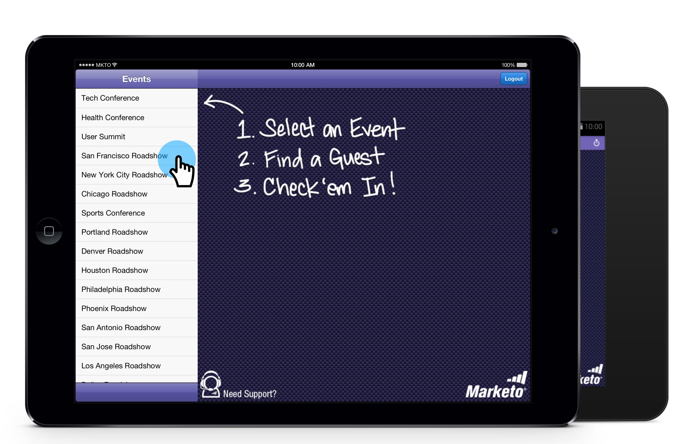

# Intégrer des personnes dans votre Événement à partir de votre tablette {#check-people-into-your-event-from-your-tablet}

Lorsque les gens se présentent à votre événement, vous pouvez trouver leurs informations sur l&#39;application. Après l’enregistrement, ils sont promus à l’état Participant lorsque vous effectuez une synchronisation avec Marketo.

L’application fonctionne de la même manière sur iPad et Android, à l’exception des différences mineures de mise en page et de conception.

>[!NOTE]
>
>**FYI**
>
>Marketo est maintenant en train de normaliser la langue dans tous les abonnements. Vous pouvez donc voir des pistes dans votre abonnement et des personnes/personnes dans docs.marketo.com. Ces termes signifient la même chose ; cela n&#39;a aucune incidence sur les instructions relatives aux articles. Il y a aussi d&#39;autres changements. [En savoir plus](http://docs.marketo.com/display/DOCS/Updates+to+Marketo+Terminology).

>[!NOTE]
>
>**Conditions préalables**
>
>* Créez un événement dans Marketo et renseignez-le avec les personnes invitées et enregistrées.
>* Téléchargement de l&#39;application pour tablette pour [Android](https://play.google.com/store/apps/details?id=com.marketo.eventcheckin&amp;hl=en) ou [iOS](https://itunes.apple.com/us/app/marketo-events/id522766637?mt=8)

>

## Enregistrement des clients enregistrés {#check-in-registered-guests}

1. Appuyez sur l’icône de l’application sur votre tablette iPad ou Android.
1. Appuyez sur **Connexion** pour lancer l’application de Événement Marketo.

   

1. Saisissez votre nom d’utilisateur et votre mot de passe Marketing Cloud, puis cliquez sur **Connexion**.

   >[!NOTE]
   >
   >Vous devez disposer d’un rôle avec accès à la base de données pour afficher les personnes dans l’application.

1. Sélectionnez un **Événement**.

   

   >[!TIP]
   >
   >Seuls les programmes de événement (à l’exception des webinars) programmés une semaine avant et une semaine après la date d’aujourd’hui s’affichent.

1. Sur l’écran d’accueil, naviguez pour trouver des invités enregistrés. Pour trouver une personne dans la liste, vous pouvez :

   * Faire défiler pour trouver un nom
   * Entrez un nom dans le champ de recherche
   * Accédez à une lettre initiale spécifique du nom en appuyant sur celle-ci sur le côté droit de la liste.

   >[!NOTE]
   >
   >Le processus est le même sur iPad et Android, mais les écrans diffèrent et les éléments peuvent se trouver à des emplacements différents. Cet article présente l’interface de l’iPad. Comparez l’écran Android de cette section à titre de référence.

   **iPad** 

   **Android**

   

1. Appuyez sur le nom sélectionné, puis sur l&#39;enregistrement de la personne, appuyez sur **Archivage**.

   

L’invité a maintenant un statut Participé et reçoit une coche. L’enregistrement de personne est mis à jour lorsque vous synchronisez avec Marketo. Le compteur rouge sur le bouton Synchroniser s’incrémente pour afficher le nombre d’enregistrements depuis la dernière synchronisation avec Marketo. Le bouton Synchroniser a un aspect différent et se trouve à un autre emplacement pour l’iPad et Android :

**iPad**

**Android**

>[!TIP]
>
>Si une personne est invitée mais ne s’est pas enregistrée, vous pouvez rechercher le nom en cliquant sur **Rechercher sur le serveur**, juste sous la zone Rechercher. L’état Invité passe à **Participation** pour le événement.

## Créer une personne sur la tablette {#create-a-new-person-on-the-tablet}

Vous pouvez ajouter manuellement des invités qui n’appartiennent pas à votre base de données Marketo. Ils seront automatiquement archivés et ajoutés à votre base de données lors de la synchronisation avec Marketo.

1. Cliquez sur **Ajouter**.

   **iPad**

   

   **Android**

   

1. Renseignez autant de champs d’informations de base que possible et appuyez sur **Terminé**.

   

   >[!NOTE]
   >
   >Vous pouvez uniquement utiliser les champs existants. Vous ne pouvez pas en créer de personnalisés.

   >[!CAUTION]
   >
   >Doublon-vérifier l&#39;adresse électronique. D&#39;autres champs peuvent être corrigés ultérieurement, mais l&#39;adresse électronique est la méthode Principale pour contacter l&#39;invité.

La nouvelle personne est enregistrée comme archivée dans votre événement et sera ajoutée à la base de données Marketo avec le statut Attended lors de la synchronisation avec Marketo.

## Inverser une arrivée {#reverse-a-check-in}

Si vous avez enregistré une personne par erreur, *avant de procéder à la synchronisation avec Marketo*, vous pouvez inverser l’état Participation.

1. Appuyez sur le nom dans la liste et, dans l’enregistrement de la personne, appuyez sur **Annuler**.

   

   Tout est réparé !

## Modifier un enregistrement de personne à l&#39;arrivée {#edit-a-person-record-at-check-in}

Vous pouvez ajouter et modifier des informations sur les invités, directement au événement !

1. Appuyez sur le nom dans la liste des personnes et appuyez sur **Modifier**.

   

1. Modifiez et ajoutez des informations aux champs, puis appuyez sur **Terminé**.

   

   >[!NOTE]
   >
   >Dans Android, le bouton **Terminé** peut être masqué. Faites défiler la page vers le bas pour la trouver.

Les informations seront mises à jour lorsque vous synchroniserez l’application avec Marketo.

## Synchronisation de l’application avec Marketo {#sync-the-app-with-marketo}

L’application Marketo Événements fonctionne indépendamment jusqu’à ce que vous resynchronisiez votre activité dans la base de données Marketo. Il est préférable de synchroniser dès que possible après la dernière arrivée. Votre tablette doit être connectée à Internet.

>[!CAUTION]
>
>Une fois la synchronisation effectuée, vous ne pouvez pas annuler l&#39;enregistrement à partir de l&#39;application.

1. Sur votre tablette, ouvrez l’application et accédez à votre événement.
1. Appuyez sur **Synchroniser**.

   Votre événement est mis à jour avec les nouveaux arrivants dans la base de données Marketo. Le compteur rouge sur le bouton Synchroniser s&#39;efface, jusqu&#39;à ce que vous entriez quelqu&#39;un d&#39;autre.

   Pour des raisons de sécurité, vous devez quitter l’application Événements Marketo une fois la synchronisation terminée.

## Utilisation d&#39;un accès Internet limité {#working-with-limited-internet-access}

Certains lieux ont un mauvais accès à Internet. Vous avez besoin d&#39;une bonne connexion à :

* Téléchargement et installation de l’application
* Connexion
* Sélectionner un événement
* Synchronisation de l’application avec Marketo

Si l&#39;accès à Internet vous préoccupe, vous pouvez vous connecter à l&#39;application Marketo Événements et sélectionner votre événement à l&#39;avance, dans un emplacement doté d&#39;un accès Internet sécurisé. Ainsi, vous pouvez toujours utiliser l’application hors ligne. Ensuite, lorsque vous récupérez une connexion Internet, synchronisez-la immédiatement vers la base de données Marketo.

>[!TIP]
>
>Si vous n&#39;avez pas de connexion Internet, vous pouvez toujours créer une nouvelle personne pour une personne qui s&#39;enregistre. Il sera réconcilié avec la personne existante lorsque vous synchroniserez l’application.

>[!NOTE]
>
>L’application vous déconnecte automatiquement après huit heures d’inactivité.

