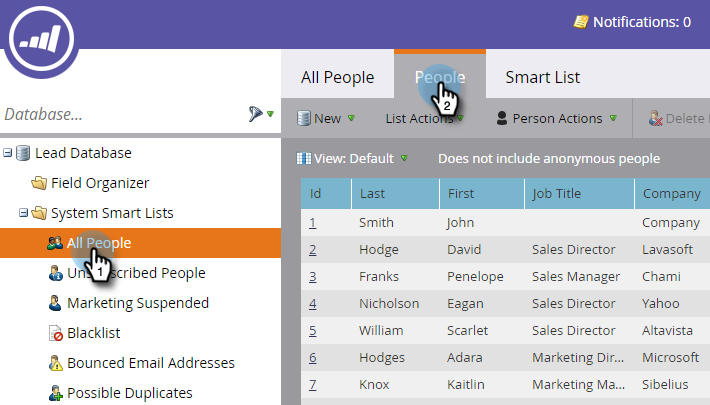

# Préparation de votre Événement {#prepare-for-your-event}

Il y a plusieurs choses à faire pour se préparer au événement.

>[!NOTE]
>
>Marketo est maintenant en train de normaliser la langue dans tous les abonnements. Vous pouvez donc voir des pistes dans votre abonnement et des personnes/personnes dans docs.marketo.com. Ces termes signifient la même chose ; cela n&#39;a aucune incidence sur les instructions relatives aux articles. Il y a aussi d&#39;autres changements. [En savoir plus](/help/marketo/getting-started/updates-to-marketo-terminology.md).

## Créer un nouveau rôle de marketing {#create-a-new-marketo-role}

Marketo a un rôle d&#39;utilisateur spécial pour l&#39;application d&#39;archivage de événements.  [Créez un nouveau rôle](https://docs.marketo.com/display/DOCS/Grant+User+Access+to+the+Check-in+App) Marketo pour les utilisateurs d’iPad ou d’Android, avec l’autorisation d’accéder à l’application mobile.

## Invitation de nouveaux utilisateurs de tablettes au Événement {#invite-new-tablet-users-to-the-event}

[Invitez de nouveaux utilisateurs de tablette à se rendre sur le événement](https://docs.marketo.com/display/DOCS/Grant+User+Access+to+the+Check-in+App) et attribuez-leur le nouveau rôle.

## Créer un Programme de Événement de marketing {#create-a-new-marketo-event-program}

[Créez un nouveau programme](/help/marketo/product-docs/demand-generation/events/understanding-events/create-a-new-event-program.md) de événement de marketing pour capturer le statut de vos employés à mesure qu’ils progressent au cours de différentes étapes et obtenir des mesures précises du retour sur investissement pour vos initiatives marketing.

## Spécifier les dates de Événement {#specify-the-event-dates}

Il est facile de définir les dates de votre événement.

1. Cliquez sur le événement de la planification et définissez le début et la date et l’heure de fin.

   

1. Faites glisser le curseur pour passer **Tentative** à **Confirmé**.

   

   >[!CAUTION]
   >
   >Si la date du Événement est antérieure ou postérieure à la date actuelle, votre événement n’apparaîtra pas dans l’application. **Conseil**: Pour le tester, définissez temporairement les dates dans une semaine du jour. N’oubliez pas de renvoyer le événement aux dates correctes après l’avoir testé.

## Ajouter des personnes à votre Événement {#add-people-to-your-event}

Maintenant que vous connaissez le *moment*, il est temps d&#39;ajouter le *qui*.

1. Si vous avez déjà une liste de personnes, dans Mon marketing, cliquez sur la mosaïque **Base de données** .

   

1. Sélectionnez une liste avec des personnes et cliquez sur l’onglet **Personnes** .

   

1. Sélectionnez les personnes pour votre événement dans la liste. Utilisez **Ctrl** (ou **Commande** sur Mac) pour cliquer sur plusieurs personnes ou **Sélectionner tout** pour les marquer toutes.

   

1. Cliquez sur Actions **** personnelles, passez la souris sur **des Programmes** et sélectionnez **Modifier l’état** du Programme.

   

1. Cliquez sur la liste déroulante **Programme** et sélectionnez votre événement.

   

1. Cliquez sur la liste déroulante **Nouveau statut** et sélectionnez **Roadshow > Registered**. Cliquez sur **Exécuter maintenant**.

   

1. Une petite fenêtre affiche la progression...

   

1. ...et indique quand la tâche est terminée.

   

   Les personnes sélectionnées sont maintenant dans votre événement, prêtes à être enregistrées à l&#39;aide de l&#39;application pour tablette sur l&#39;étage du salon.
