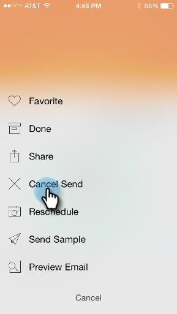

# Présentation des cartes du programme de messagerie {#understanding-email-program-cards}

Utilisez Moments Marketo pour afficher vos programmes de messagerie à partir de votre téléphone ou d’iPad.

>[!IMPORTANT]
>
>Le 2 octobre 2023, Adobe a supprimé l’application Marketo Moments de toutes les boutiques d’applications. Si l’application est déjà installée sur votre tablette/périphérique mobile, vous pouvez continuer à l’utiliser pour le moment. Une fois votre instance de Marketo Engage migrée vers Adobe Identity pour l’authentification de Marketo, vous ne pourrez plus accéder à l’application. [En savoir plus](https://nation.marketo.com/t5/product-discussions/marketo-events-app-and-marketo-moments-app-end-of-life/m-p/340712/highlight/true#M193869){target="_blank"}.

## Email Program Cards {#email-program-cards}

Lorsque vous appuyez sur n’importe quelle carte du programme de messagerie, vous pouvez :

* [Créer un email comme favori](/help/marketo/product-docs/core-marketo-concepts/mobile-apps/marketo-moments/working-with-moments/creating-a-favorite.md)
* [Marquage d’un email comme terminé](/help/marketo/product-docs/core-marketo-concepts/mobile-apps/marketo-moments/working-with-moments/marking-it-done.md)
* [Partage d’une carte de moment de courrier électronique](/help/marketo/product-docs/core-marketo-concepts/mobile-apps/marketo-moments/working-with-moments/sharing-a-moment.md)

Sur une carte du programme de messagerie pour un courrier électronique qui n’est pas encore envoyé, vous trouverez des informations sur l’état et l’audience de ce programme de messagerie.

Une fois l&#39;email envoyé, la carte affiche d&#39;autres informations utiles, notamment le nombre d&#39;emails délivrés, les actions des destinataires et un lien vers la liste dynamique utilisée dans la campagne.

## Confirmation d’une carte électronique {#confirming-an-email-card}

1. Pour confirmer une carte de messagerie non confirmée, appuyez sur le menu à trois points.

   

1. Appuyez sur **[!UICONTROL Confirmer]**.

   

1. Appuyez sur **[!UICONTROL Confirmer]** pour terminer la tâche ou sur **[!UICONTROL Never Mind]** si vous avez réfléchi de nouveau.

   

   >[!NOTE]
   >
   >Maintenant ta carte va devenir orange !

## Annulation de l’envoi d’une carte de courriel {#canceling-an-email-card-send}

1. Si vous décidez de ne pas envoyer votre message électronique confirmé, appuyez sur le menu à trois points.

   

1. Appuyez sur **[!UICONTROL Annuler l’envoi]**.

   

## Replanification d’une carte électronique {#rescheduling-an-email-card}

Vous pouvez replanifier les cartes électroniques confirmées ou non confirmées.

>[!NOTE]
>
>Pour les emails déjà confirmés, vous devez d’abord annuler l’email (voir ci-dessous).

1. Pour replanifier un email, appuyez sur le menu à trois points.

   

1. Appuyez sur **[!UICONTROL Replanifier]**.

   

1. Sélectionnez une date dans le calendrier et appuyez sur **[!UICONTROL Replanifier]**.

   

   Tant que vous disposez d&#39;un service sans fil, vous pouvez le replanifier depuis n&#39;importe où !

## Envoi d’un exemple {#sending-a-sample}

Vous pouvez partager un exemple d’un moment d’email directement avec quelqu’un.

1. Ouvrez le menu Carte.

   

1. Appuyez sur **[!UICONTROL Send Sample]**.

   

1. Saisissez une adresse électronique et cliquez sur **[!UICONTROL Envoyer un exemple]**.

   

## Aperçu d’un email {#previewing-an-email}

Cliquez avec le bouton droit de la souris sur une carte de courriel pour la prévisualiser.

1. Appuyez sur **[!UICONTROL Preview Email]**.

   

   Ainsi, vous savez que votre email est parfait avant d&#39;appuyer sur la gâchette !

   

>[!MORELIKETHIS]
>
>* [Comprendre les moments Marketo](/help/marketo/product-docs/core-marketo-concepts/mobile-apps/marketo-moments/understanding-moments/understanding-marketo-moments.md)
>* [Comprendre les cartes d’événements](/help/marketo/product-docs/core-marketo-concepts/mobile-apps/marketo-moments/understanding-moments/understanding-event-cards.md)
>* [Compréhension des cartes Analytics](/help/marketo/product-docs/core-marketo-concepts/mobile-apps/marketo-moments/understanding-moments/understanding-analytics-cards.md)
