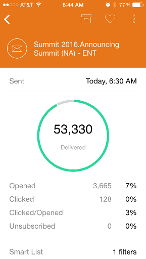

# Présentation des cartes de Programme de messagerie {#understanding-email-program-cards}

Utilisez Moments du marketing pour vue vos Programmes électroniques à partir de votre téléphone ou de votre iPad.

## Cartes de Programme par courriel {#email-program-cards}

`<iframe width="420" height="315" src="https://www.youtube-nocookie.com/embed/n8JTSZI22Do" frameborder="0" allowfullscreen></iframe>` Lorsque vous appuyez sur une carte de Programme de messagerie, vous pouvez :

* [Créer un courriel comme favori](../../../../../product-docs/core-marketo-concepts/mobile-apps/marketo-moments/working-with-moments/creating-a-favorite.md)
* [Marquage d’un courrier électronique comme effectué](../../../../../product-docs/core-marketo-concepts/mobile-apps/marketo-moments/working-with-moments/marking-it-done.md)
* [Partage d’une carte de moment de courrier électronique](../../../../../product-docs/core-marketo-concepts/mobile-apps/marketo-moments/working-with-moments/sharing-a-moment.md)

Sur une carte de programme électronique pour un courrier électronique qui n’est pas encore envoyé, vous trouverez des informations sur l’état et l’audience de ce programme électronique.

Une fois le courrier électronique envoyé, la carte affiche d’autres informations importantes, notamment le nombre de courriers électroniques remis, les actions des destinataires et un lien vers la liste active utilisée dans la campagne.

## Confirmation d’une carte de messagerie {#confirming-an-email-card}

1. Pour confirmer une carte de messagerie non confirmée, appuyez sur le menu à trois points.

   

1. Appuyez sur **Confirmer**.

   

1. Appuyez sur **Confirmer **pour terminer le travail, ou **Ne vous souciez** jamais si vous avez réfléchi.

   

   >[!NOTE]
   >
   >Maintenant votre carte va se transformer en orange !

## Annulation de l&#39;envoi d&#39;une carte de messagerie {#canceling-an-email-card-send}

1. Si vous décidez de ne pas envoyer votre courriel confirmé, appuyez sur le menu à trois points.

   

1. Appuyez sur **Annuler l’envoi**.

   

## Replanifier une carte de messagerie {#rescheduling-an-email-card}

Vous pouvez replanifier les cartes électroniques confirmées ou non confirmées.

>[!NOTE]
>
>Pour les courriels déjà confirmés, vous devez d&#39;abord annuler le courriel (voir ci-dessous).

1. Pour replanifier un courriel, appuyez sur le menu à trois points.

   

1. Appuyez sur **Replanifier**.

   

1. Sélectionnez une date dans le calendrier et appuyez sur **Replanifier**.

   

   Tant que vous disposez d&#39;un service sans fil, vous pouvez le replanifier depuis n&#39;importe où !

## Envoi d’un exemple {#sending-a-sample}

Vous pouvez partager un exemple de moment de courrier électronique directement avec quelqu’un.

1. Ouvrez le menu Carte.

   

1. Appuyez sur **Envoyer un exemple**.

   

1. Entrez une adresse électronique et cliquez sur **Envoyer un exemple**.

   

## Prévisualisation d’un courrier électronique {#previewing-an-email}

Cliquez avec le bouton droit sur une carte de courriel pour la prévisualisation.

1. Appuyez sur Courriel **** de Prévisualisation.

   

   De cette façon, vous savez que votre courriel est parfait avant de tirer sur la gâchette !\
   

   Excellent !

Et c&#39;est le scoop pour voir vos campagnes par courriel. Maintenant, vous êtes un pro !

>[!MORELIKETHIS]
>
>* [Présentation des moments marketing](understanding-marketo-moments.md)
>* [Présentation des cartes de Événement](understanding-event-cards.md)
>* [Présentation des cartes Analytics](understanding-analytics-cards.md)
>* [Programmes de messagerie](http://docs.marketo.com/display/docs/email+programs)

>

