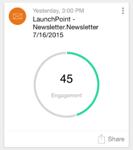
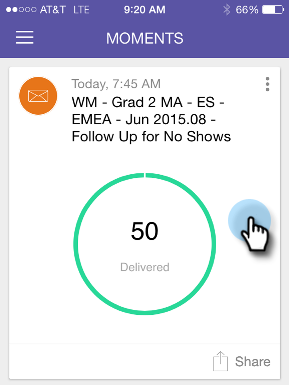

# Présentation des moments marketing {#understanding-marketo-moments}

Le pouvoir de Marketo est maintenant entre vos mains, littéralement ! Prévisualisation et replanification des e-mails directement depuis votre téléphone ou votre iPad.

>[!NOTE]
>
>**Disponibilité**
>
>L’autorisation d’accès aux applications mobiles est requise. Contactez votre administrateur marketing pour [mettre à jour votre rôle](../../../../../product-docs/administration/users-and-roles/managing-user-roles-and-permissions.md).

## Présentation des moments {#introducing-moments}

`<iframe width="420" height="315" src="https://www.youtube-nocookie.com/embed/IJfpzE8l73E" frameborder="0" allowfullscreen></iframe>`

## Flux {#streams}

Voici les différents courants dans Moments.

>[!NOTE]
>
>**Définition**
>
>Moments - Tout ce qui vient de courir, ou qui est sur le point de courir va ici.
>
>Favoris - Tout ce que vous faites comme favori entre ici.
>
>Plus tard - Tout ce qui se passe plus tard que ce moment va dans ici.
>
>Terminé - Tout ce qui a fini de courir ou que vous avez marqué comme terminé va ici.

Bon, maintenant que nous avons tout perdu, jetons un oeil sur les Moments du Marketo sur un téléphone !

## Trois types de cartes {#three-kinds-of-cards}

Marketo Moments vous donne trois cartes différentes pour suivre la progression de votre courrier électronique :

**On-Deck**  - Ce courriel est sur le point de sortir. C&#39;est votre dernière chance de le prévisualisation, d&#39;envoyer un échantillon ou même de l&#39;annuler si vous le devez.

**battement**  de coeur - Hey, ce courriel est livré maintenant ! Et voici aussi les statistiques. Allez-y et partagez-le.

**Résultats**  - Voici comment s&#39;est déroulé le courriel. Une fois l’exécution du courrier électronique terminée, la carte Résultats affiche le score d’engagement et d’autres statistiques.

## Moments Stream {#moments-stream}

Lorsque vous ouvrez l’application pour la première fois ou appuyez sur **Moments** dans le menu, les cartes appropriées s’affichent en premier. Chacun contient des informations sur cette initiative marketing spécifique et ses performances globales.

Appuyez sur la carte pour ouvrir un écran de détails.

>[!NOTE]
>
>Les cartes en orange sont confirmées ; les gris sont hésitants.

Appuyez sur les trois points pour ouvrir un menu d’action de carte.

Super ! Maintenant, vous pouvez faire en sorte que quelque chose arrive en appuyant sur :

>[!NOTE]
>
>**Définition**
>
>* Favori : Il est facile de prêter attention à ce qui est le plus opportun et le plus important si vous les rendez favoris.
>* Terminé : Terminé retire le produit de votre vue Moments du marché (mais le laisse sur le marché, sûr et sonore).
>* Partager : Envoyez une image pour motiver ou féliciter votre équipe.
>* Envoyer un exemple (courriel uniquement) : Utilisez-le pour permettre à d&#39;autres de vérifier l&#39;aspect de vos courriels avant de les envoyer.
>* Courriel de la prévisualisation (courriel uniquement) : C&#39;est toujours une bonne idée de vérifier vos e-mails à l&#39;avance.

>

## Moments ultérieurs {#later-moments}

La section Plus tard présente les activités à venir.

1. Début en appuyant sur le menu du hamburger.

   >[!NOTE]
   >
   >Selon le [Guinness Book of World Records](http://www.guinnessworldrecords.com/world-records/largest-hamburger), le plus grand hamburger du monde pesait 2 014 lb.

   

1. Appuyez sur **Ultérieurement**.

   

   Voir une liste des activités à venir.

   

## Cartes de Programme par courriel {#email-program-cards}

Les cartes de programme par courriel montrent des choses importantes comme la planification, l&#39;audience, l&#39;état et d&#39;autres choses utiles, même lorsque vous êtes dehors au déjeuner.

## Cartes de événement {#event-cards}

Pour les événements, vous verrez le nombre total de membres et leur état.

## Analytics Cards {#analytics-cards}

Les cartes d’instant Analytics vous montrent comment vos courriels et vos événements se comportent, mois après mois, au cours des six derniers mois, pour :

1. Pistes acquises
1. Nouvelles pistes
1. Désabonnements

## Cartes d&#39;exécution Campaign Smart {#smart-campaign-run-cards}

Les cartes de campagne dynamiques représentent une seule exécution d’une campagne. Une nouvelle carte s’affiche chaque fois que la campagne dynamique s’exécute. Appuyez sur pour afficher les filtres de liste intelligents utilisés, le flux de la campagne et chacun des courriers électroniques utilisés dans la campagne.

## Confirmer ou annuler une action {#confirm-or-cancel-an-action}

A chaque étape, vous pouvez confirmer ou annuler une action. Si vous changez d’avis, il vous suffit d’appuyer sur **Never Mind**.

Prêt à en apprendre davantage ?

>[!MORELIKETHIS]
>
>* [Présentation des cartes de Programme de messagerie](understanding-email-program-cards.md)
>* [Présentation des cartes de Événement](understanding-event-cards.md)
>* [Présentation des cartes Analytics](understanding-analytics-cards.md)
>* [Présentation des cartes Campaign Smart](understanding-smart-campaign-cards.md)

>

## Versions prises en charge {#supported-versions}

Marketo Moments prend en charge les versions suivantes du système d’exploitation :

* Apple iOS 8.0 et versions ultérieures.
* Android version 4.1 et ultérieure (essentiellement Jellybean et up).

