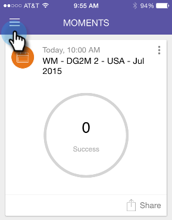
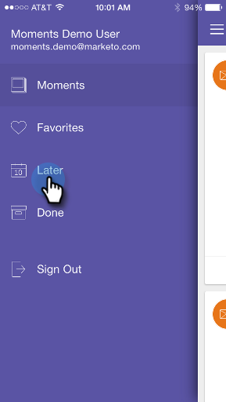

# Présentation des moments Marketo {#understanding-marketo-moments}

La puissance de Marketo est désormais à votre disposition ! Prévisualisez les e-mails et planifiez à nouveau leur envoi à partir de votre téléphone ou de votre iPad.

>[!IMPORTANT]
>
>Le 2 octobre 2023, Adobe a supprimé l’application Marketo Moments de toutes les boutiques d’applications. Si l’application est déjà installée sur votre tablette/périphérique mobile, vous pouvez continuer à l’utiliser pour le moment. Une fois votre instance de Marketo Engage migrée vers Adobe Identity pour l’authentification de Marketo, vous ne pourrez plus accéder à l’application. [En savoir plus](https://nation.marketo.com/t5/product-discussions/marketo-events-app-and-marketo-moments-app-end-of-life/m-p/340712/highlight/true#M193869){target="_blank"}.

>[!NOTE]
>
>_Accès aux applications mobiles_ autorisation requise. Contactez votre administrateur Marketo pour [mettre à jour votre rôle](/help/marketo/product-docs/administration/users-and-roles/managing-user-roles-and-permissions.md).

## Streams {#streams}

Voici les différents courants dans Moments.

>[!NOTE]
>
>**Définition**
>
>* Moments : Tout ce qui vient d&#39;arriver, ou qui est sur le point de courir, va ici.
>* Favoris : tout ce que vous faites comme favori s&#39;y trouve.
>* Plus tard : tout ce qui se passe plus tard que ce moment se passe ici.
>* Terminé : tout ce qui a fini de fonctionner ou que vous avez marqué comme terminé s’affiche ici.

OK, maintenant que nous avons tout perdu, jetons un coup d&#39;oeil à Marketo Moments sur un téléphone !

## Trois types de cartes {#three-kinds-of-cards}

Marketo Moments vous donne trois cartes différentes pour suivre la progression de votre email :

**On-Deck** - Cet email est sur le point de sortir. C&#39;est votre dernière chance de le prévisualiser, d&#39;envoyer un exemple ou même de l&#39;annuler si vous le devez.

**Heart-beat** - Hey, cet email est en train d&#39;être livré maintenant ! Et voici aussi des statistiques. Allez-y et partagez-le.

**Résultats** - Voici comment s&#39;est déroulé l&#39;email. Une fois l’exécution du courrier électronique terminée, la carte Résultats affiche le score d’engagement et d’autres statistiques.

## Flux de moments {#moments-stream}

Lorsque vous ouvrez l’application pour la première fois, appuyez sur **Moments** dans le menu, les cartes pertinentes s’affichent en premier. Chacune d’elles contient des informations sur cette initiative marketing spécifique et ses performances globales.

Appuyez sur la carte pour ouvrir un écran de détail.

>[!NOTE]
>
>Les cartes en orange sont confirmées ; les cartes en gris sont provisoires.

Appuyez sur les trois points pour ouvrir un menu d’action de carte.

Fantastique ! Maintenant, vous pouvez faire que quelque chose se produise en appuyant sur :

>[!NOTE]
>
>**Définition**
>
>* Favori : il est facile d&#39;être attentif aux éléments les plus opportuns et importants si vous les rendez favoris.
>* Terminé : Terminé désactive la vue Marketo Moments (mais la laisse dans Marketo, sûre et sonore).
>* Partager : envoyez une image pour motiver ou féliciter votre équipe.
>* Envoyer un exemple (email uniquement) : utilisez cette option pour permettre à d&#39;autres utilisateurs de vérifier l&#39;aspect de vos emails avant de les envoyer.
>* Prévisualiser l&#39;email (emails uniquement) : il est toujours préférable de consulter vos emails à l&#39;avance.

## Moments ultérieurs {#later-moments}

La section Plus tard présente les activités à venir.

1. Commencez par appuyer sur le menu du hamburger.

   

1. Appuyer **Plus tard**.

   

   Consultez la liste des activités à venir.

   

## Email Program Cards {#email-program-cards}

Les cartes de programme de messagerie électronique présentent des éléments importants tels que le planning, l’audience, le statut et d’autres éléments utiles, même lorsque vous êtes à l’heure du déjeuner.

## Cartes d’événements {#event-cards}

Pour les événements, vous verrez le nombre total de membres et leur état.

## Analytics Cards {#analytics-cards}

Les cartes de moment Analytics vous montrent comment vos e-mails et événements fonctionnent d’un mois à l’autre au cours des six derniers mois, pour :

1. Pistes acquises
1. Nouveaux leads
1. Désabonnements

## Cartes d’exécution de campagne intelligente {#smart-campaign-run-cards}

Les cartes de campagne dynamiques représentent une seule exécution d’une campagne. Une nouvelle carte s’affiche chaque fois que la campagne dynamique s’exécute. Appuyez pour afficher les filtres de liste dynamique utilisés, le flux de la campagne et chacun des emails utilisés dans la campagne.

## Confirmation ou annulation d’une action {#confirm-or-cancel-an-action}

À chaque étape, vous pouvez confirmer ou annuler une action. Si vous changez d&#39;avis, appuyez simplement **Ne vous souciez Jamais**.

## Versions prises en charge  {#supported-versions}

Marketo Moments prend en charge les versions suivantes du système d’exploitation :

* Apple iOS 8.0 et versions ultérieures.
* Android version 4.1 et ultérieure (en gros Jellybean et up).

Prêt pour la formation ?

>[!MORELIKETHIS]
>
>* [Présentation des cartes du programme de messagerie](/help/marketo/product-docs/core-marketo-concepts/mobile-apps/marketo-moments/understanding-moments/understanding-email-program-cards.md)
>* [Présentation des cartes d’événements](/help/marketo/product-docs/core-marketo-concepts/mobile-apps/marketo-moments/understanding-moments/understanding-event-cards.md)
>* [Présentation des cartes Analytics](/help/marketo/product-docs/core-marketo-concepts/mobile-apps/marketo-moments/understanding-moments/understanding-analytics-cards.md)
>* [Présentation des cartes de campagne intelligente](/help/marketo/product-docs/core-marketo-concepts/mobile-apps/marketo-moments/understanding-moments/understanding-smart-campaign-cards.md)
