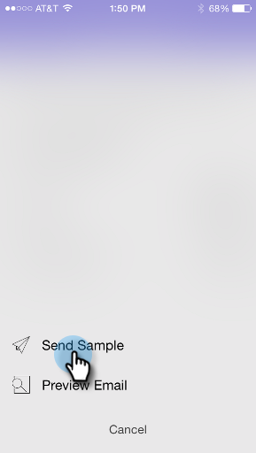
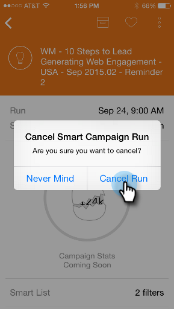

# Présentation des cartes Campaign Smart {#understanding-smart-campaign-cards}

Utilisez Moments marketing pour vue chaque exécution de vos campagnes intelligentes depuis votre smartphone ou votre iPad. La carte de campagne Moments marketing représente une exécution unique d’une campagne ; une nouvelle carte s’affiche chaque fois que la campagne active. Les cartes de campagne intelligentes sont marquées avec une ampoule en haut à gauche.

Pour les futures campagnes actives planifiées mais non encore exécutées, la carte Moments du marketing n’affiche pas encore les statistiques de campagne. Ils apparaîtront dans une prochaine version.

## Cartes Campaign Smart {#smart-campaign-cards}

1. Appuyez sur la carte pour ouvrir la carte de détails.

   

1. La carte de détails vous donne accès aux informations sur les filtres de Liste intelligente, le flux et le résumé du courrier électronique.
1. Appuyez sur **Liste intelligente**.

   

1. Les filtres utilisés par la liste intelligente sont présentés ici.

   

1. Appuyez sur **Flux**.

   

1. Maintenant, vous verrez le flux de la Campaign Intelligente. Cette campagne ne comporte qu’une seule étape de flux, mais il peut y en avoir plusieurs.

   

1. Cliquez sur **Email Summary**.

   

1. Désormais, vous pouvez voir la réponse du destinataire à chaque courriel, en nombre et en pourcentage.

   

1. Vous voyez ces deux points en bas ? Ils indiquent qu’il y a deux courriers électroniques connectés à cette campagne intelligente. Pour vue les résultats de l’autre courriel, faites glisser l’écran vers la gauche. Voici les résultats du deuxième courriel.

   

   >[!NOTE]
   >
   >Notez que l’autre point est maintenant surligné.

## Création d’exemples et de Prévisualisations de messagerie {#creating-email-samples-and-previews}

C&#39;est une bonne idée de jeter un coup d&#39;oeil à un courriel avant qu&#39;il ne sorte. Ou bien, envoyez un échantillon à quelqu&#39;un d&#39;autre pour avoir un second ensemble d&#39;yeux dessus.

1. Appuyez sur le menu d’action à trois points d’un courrier électronique.

   

1. Appuyez sur [Envoyer un exemple](../../../../../product-docs/core-marketo-concepts/mobile-apps/marketo-moments/working-with-moments/sending-a-sample.md) ou [Courriel de Prévisualisation](../../../../../product-docs/core-marketo-concepts/mobile-apps/marketo-moments/working-with-moments/previewing-an-email.md) (cliquez sur ces liens pour plus de détails).

   

## Confirmation d&#39;une exécution Campaign intelligente {#confirming-a-smart-campaign-run}

Les cartes des campagnes dynamiques non confirmées sont grisées jusqu’à ce que vous les confirmiez. Puis ils deviennent orange.

1. Pour confirmer une carte de campagne à puce non confirmée, appuyez sur le menu d’action à trois points.

   

1. Appuyez sur **Confirmer**.

   

1. Appuyez sur **Confirmer** pour terminer le travail, ou **Ne vous souciez jamais** si vous avez des doutes.

   

   >[!NOTE]
   >
   >Maintenant votre carte va se transformer en orange !

## Annulation d&#39;une exécution Campaign intelligente {#canceling-a-smart-campaign-run}

Vous pouvez annuler une exécution de campagne dynamique planifiée confirmée.

1. Appuyez sur le menu d’action à trois points.

   

1. Appuyez sur **Annuler l&#39;exécution**.

   

1. Appuyez sur **Annuler l&#39;exécution**. Si vous décidez à la dernière minute de ne pas annuler l’exécution, appuyez sur **Jamais d’indifférence** et la campagne dynamique s’exécutera comme prévu.

   

## Replanifier une Campaign intelligente {#rescheduling-a-smart-campaign}

Vous pouvez replanifier une campagne dynamique confirmée qui ne s’est pas encore exécutée.

1. Appuyez sur le menu d’action à trois points.

   

1. Appuyez sur **Replanifier**.

   

1. Sélectionnez une date dans le calendrier et appuyez sur **Replanifier**.

   

   Un morceau de gâteau !

## Autres actions Smart Campaign {#other-smart-campaign-actions}

Comme pour les autres cartes Moments du marketing, vous pouvez appuyer sur les trois points sur n’importe quelle carte Campaign dynamique ou carte de détails pour :

* [En faire un favori](../../../../../product-docs/core-marketo-concepts/mobile-apps/marketo-moments/working-with-moments/creating-a-favorite.md)
* [Marquer comme terminé](../../../../../product-docs/core-marketo-concepts/mobile-apps/marketo-moments/working-with-moments/marking-it-done.md)
* [Partager](../../../../../product-docs/core-marketo-concepts/mobile-apps/marketo-moments/working-with-moments/sharing-a-moment.md)

>[!NOTE]
>
>Vous pouvez également appuyer sur l’icône **Partager** d’une carte Campaign dynamique à partager, et sur les icônes **Terminé** et **Favori** de la carte de détails.

## Supprimer rapidement une carte Campaign à puce {#quickly-delete-a-smart-campaign-card}

Si vous avez une carte dont vous n&#39;avez plus besoin, peut-être une carte que vous avez utilisée pour le test, vous pouvez vous en débarrasser par un glissement rapide vers la gauche ou la droite.
