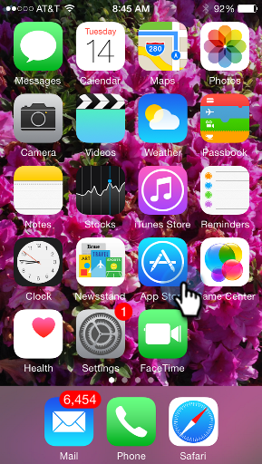
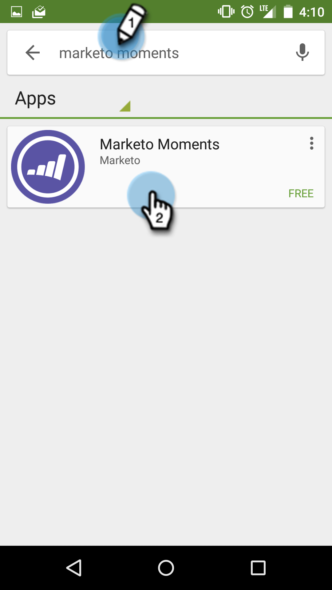

# Téléchargement de moments marketing {#downloading-marketo-moments}

Téléchargez Moments marketing depuis l’App Store ou Google Play et voilà ! La magie du marketing dans la paume de votre main.

## Pour iPhone {#for-iphone}

1. Accédez à l’[App Store](https://itunes.apple.com/us/genre/ios/id36?mt=8).\
   

1. Recherchez Moments marketing et sélectionnez-le.\
   

1. Appuyez ensuite sur **Ouvrir**.\
   

## Pour Android {#for-android}

1. Accédez à [Google Play](https://play.google.com/store?hl=en).
1. Recherchez Moments marketing et appuyez sur pour télécharger.\
   

1. Appuyez sur **Accepter**.\
   

1. Appuyez sur **Installer**.\
   

Bon appétit !

>[!NOTE]
>
>Connectez-vous à l’aide de votre connexion et de votre mot de passe Marketo standard.
>
>L’authentification unique avec le langage SAML (Security Assertion Markup Language) n’est pas prise en charge pour les moments marketing.

>[!MORELIKETHIS]
>
>[Présentation des moments marketing](../../../../../product-docs/core-marketo-concepts/mobile-apps/marketo-moments/understanding-moments/understanding-marketo-moments.md)

