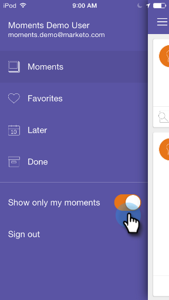

# Personnalisation des Moments Marketo {#personalizing-marketo-moments}

Lorsqu’il existe de nombreux programmes marketing et campagnes intelligentes, il est utile de se concentrer uniquement sur votre propre travail.

>[!IMPORTANT]
>
>Le 2 octobre 2023, Adobe a supprimé l’application Marketo Moments de tous les magasins d’applications. Si l’application est déjà installée sur votre tablette ou votre appareil mobile, vous pouvez continuer à l’utiliser pour le moment. Une fois votre instance Marketo Engage migrée vers Adobe Identity pour l’authentification de Marketo, vous ne pourrez plus accéder à l’application. [En savoir plus](https://nation.marketo.com/t5/product-discussions/marketo-events-app-and-marketo-moments-app-end-of-life/m-p/340712/highlight/true#M193869){target="_blank"}.

Activez **[!UICONTROL Afficher uniquement mes moments]** pour n’afficher que vos propres programmes de messagerie et campagnes intelligentes.

Ou désactivez **[!UICONTROL Afficher uniquement mes moments]** pour afficher toutes les campagnes intelligentes et les programmes de messagerie auxquels vous avez accès.

