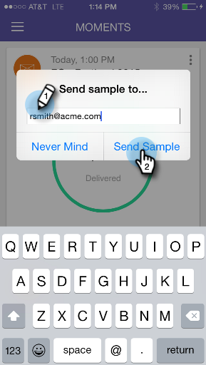

# Envoi d’un exemple {#sending-a-sample}

Vous pouvez partager un exemple d’e-mail directement avec quelqu’un. Il y a deux façons de le faire.

>[!IMPORTANT]
>
>Le 2 octobre 2023, Adobe a supprimé l’application Marketo Moments de tous les magasins d’applications. Si l’application est déjà installée sur votre tablette ou votre appareil mobile, vous pouvez continuer à l’utiliser pour le moment. Une fois votre instance Marketo Engage migrée vers Adobe Identity pour l’authentification de Marketo, vous ne pourrez plus accéder à l’application. [En savoir plus](https://nation.marketo.com/t5/product-discussions/marketo-events-app-and-marketo-moments-app-end-of-life/m-p/340712/highlight/true#M193869){target="_blank"}.

## La voie normale {#the-regular-way}

1. Ouvrez le menu Carte .

   

1. Appuyez sur **[!UICONTROL Envoyer l’exemple]**.

   

1. Saisissez une adresse e-mail et cliquez sur **[!UICONTROL Envoyer un exemple]**.

   

## La Voie Rapide {#the-quick-way}

1. Appuyez sur l’icône d’avion papier sur l’écran [!UICONTROL Aperçu de l’e-mail] pour envoyer un échantillon directement à partir de l’aperçu.

   
