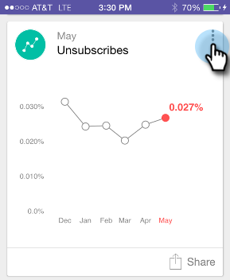
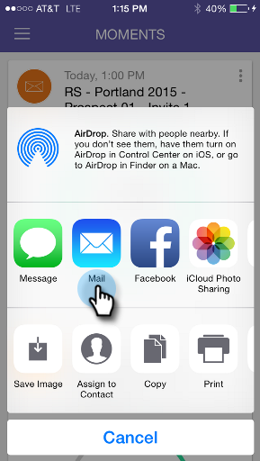

# Partager un moment {#sharing-a-moment}

Vous souhaitez mettre à jour votre équipe ? Vous avez le choix entre deux options de partage :

1. Appuyez sur l’icône **Partager** de la carte.

   

1. Appuyez sur le menu Carte et appuyez sur **Partager** sur l’écran Détails.

   

   

1. Sélectionnez le mode de partage souhaité. Allons-y avec l&#39;email.

   >[!NOTE]
   >
   >Le partage dépend des applications installées sur votre téléphone. Donc, si vous n&#39;avez pas Facebook, vous ne le verrez pas dans Moments.

   

1. Saisissez l’adresse de votre destinataire, un objet et appuyez sur **Envoyer**.

   

   Super boulot !

