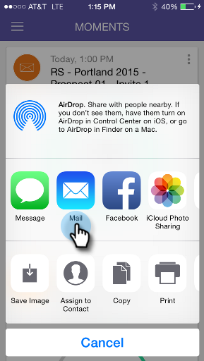
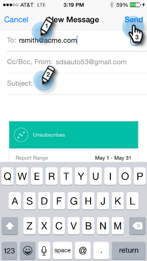

# Partage d’un Moment {#sharing-a-moment}

Il y a deux façons de partager un moment.

>[!IMPORTANT]
>
>Le 2 octobre 2023, Adobe a supprimé l’application Marketo Moments de tous les magasins d’applications. Si l’application est déjà installée sur votre tablette ou votre appareil mobile, vous pouvez continuer à l’utiliser pour le moment. Une fois votre instance Marketo Engage migrée vers Adobe Identity pour l’authentification de Marketo, vous ne pourrez plus accéder à l’application. [En savoir plus](https://nation.marketo.com/t5/product-discussions/marketo-events-app-and-marketo-moments-app-end-of-life/m-p/340712/highlight/true#M193869){target="_blank"}.

1. Appuyez sur l’icône **[!UICONTROL Partager]** sur la carte.

   

1. Appuyez sur le menu de la carte, puis sur **[!UICONTROL Partager]** dans l’écran Détails.

   

   

1. Sélectionnez la manière dont vous souhaitez partager. Dans cet exemple, l’adresse e-mail est sélectionnée.

   >[!NOTE]
   >
   >Le partage dépend des applications installées sur votre téléphone. Si [!DNL Facebook] n’est pas installé, il n’apparaîtra pas dans les Moments.

   

1. Saisissez l’adresse et l’objet de votre destinataire, puis appuyez sur **[!UICONTROL Envoyer]**.

   
