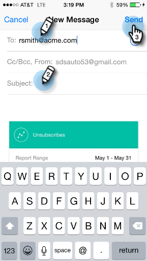

# Partager un moment {#sharing-a-moment}

Vous souhaitez mettre à jour votre équipe ? Vous avez deux choix pour sélectionner le partage.

>[!IMPORTANT]
>
>Le 2 octobre 2023, Adobe a supprimé l’application Marketo Moments de toutes les boutiques d’applications. Si l’application est déjà installée sur votre tablette/périphérique mobile, vous pouvez continuer à l’utiliser pour le moment. Une fois votre instance de Marketo Engage migrée vers Adobe Identity pour l’authentification de Marketo, vous ne pourrez plus accéder à l’application. [En savoir plus](https://nation.marketo.com/t5/product-discussions/marketo-events-app-and-marketo-moments-app-end-of-life/m-p/340712/highlight/true#M193869){target="_blank"}.

1. Appuyez sur l’icône **[!UICONTROL Partager]** sur la carte.

   

1. Appuyez sur le menu de la carte et appuyez sur **[!UICONTROL Partager]** sur l’écran Détails.

   

   

1. Sélectionnez le mode de partage souhaité. Allons-y avec les emails.

   >[!NOTE]
   >
   >Le partage dépend des applications installées sur votre téléphone. Donc, si vous n&#39;avez pas Facebook, vous ne le verrez pas dans Moments.

   

1. Saisissez l’adresse de votre destinataire, un objet et appuyez sur **[!UICONTROL Envoyer]**.

   
