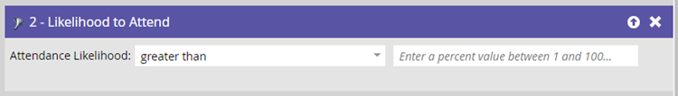
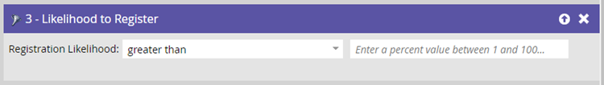
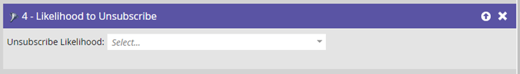

# Filtres prédictifs {#predictive-filters}

Dans le cadre des audiences prédictives, Marketo propose un groupe de filtres basés sur l’intelligence artificielle et l’apprentissage automatique dans les listes dynamiques des campagnes dynamiques.

>[!NOTE]
>
>Les filtres &quot;Probable de participation&quot; et &quot;Probable d’inscription&quot; ne peuvent être utilisés que dans les programmes d’événement. Il est possible d’utiliser &quot;Probabilité de désabonnement&quot;, &quot;Lookalike of Program Members&quot; et &quot;Lookalike of Smart List Members&quot; dans tous les types de programmes.

## Probabilité de participation {#likelihood-to-attend}

Ce filtre est utilisé pour réduire efficacement votre audience. Cela vous permet de cibler et d’inviter des pistes ayant une plus forte probabilité d’ **assister** à votre webinaire ou événement. Notez que votre &quot;Probabilité d’assister au programme&quot; sera votre programme d’événements actuel.

## Probabilité d’inscription {#likelihood-to-register}

Tout comme le filtre _Probabilité d’assister_, utilisez ce filtre pour réduire votre audience et cibler les pistes qui ont une probabilité plus élevée d’ **enregistrement** pour votre webinaire ou événement.

## Probabilité de désinscription {#likelihood-to-unsubscribe}

Cela filtre l’audience selon qu’elle a une forte ou une faible probabilité de désabonnement au cours des deux prochaines semaines. Vous pouvez l’utiliser pour cibler les pistes à forte fatigue différemment et plus efficacement. Le seuil de désabonnement est dynamique et piloté par un modèle AI qui prend en compte plusieurs attributs, notamment le temps d’avance dans la base de données et les activités de piste.

>[!NOTE]
>
>Les filtres Probabilité de participation/enregistrement/désabonnement doivent être utilisés conjointement avec d’autres filtres standard.

## Logique des membres de programme/Lookalike des membres de liste dynamique {#lookalike-of-members}

Ces deux filtres vous aident à développer votre audience actuelle en ciblant des pistes supplémentaires similaires aux membres d’un autre programme ou d’une liste dynamique. Les filtres Lookalike prennent en compte plus de 50 facteurs, notamment les attributs de prospect, l’activité de courrier électronique, l’activité web et l’engagement.

Cliquez sur **[!UICONTROL Ajouter la contrainte]** pour choisir les critères de réussite des membres du ou des programmes sélectionnés.

Cliquez sur l’icône **+** pour ajouter facilement plusieurs programmes/listes dynamiques à un seul filtre.

## Informations à noter {#things-to-note}

* Vous pouvez appliquer des filtres prédictifs à une campagne dynamique même si le programme parent est créé avant l’activation des filtres prédictifs.
* Les filtres prédictifs ne sont pas disponibles pour les campagnes de déclenchement.
* Le clonage ou le déplacement de campagnes contenant des filtres prédictifs n’est pas pris en charge.
* Vous pouvez utiliser jusqu’à 5 filtres prédictifs dans une liste dynamique.
* Si Marketo Engage rencontre une erreur lors de l’évaluation des filtres prédictifs, l’exécution de la campagne est automatiquement abandonnée et vous recevrez une notification dans le centre de notification Marketo.
* Les filtres prédictifs ont actuellement une limite d’entrée de 1 million de personnes qualifiées.
* Vous pouvez avoir jusqu’à 50 programmes actifs avec des filtres prédictifs.
