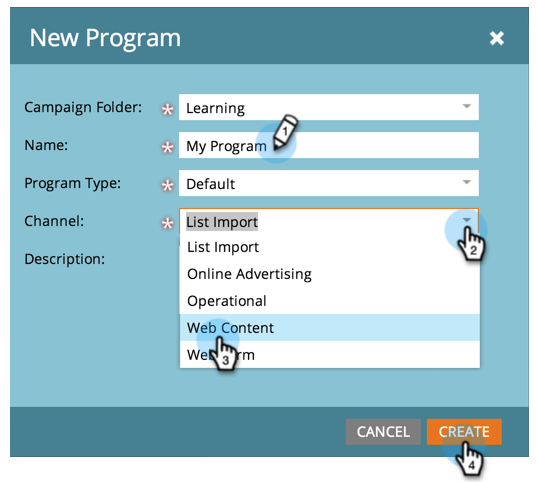

# Créer un programme {#create-a-program}

Les programmes sont l’un des éléments les plus importants de Marketo. Vous les utiliserez beaucoup !

1. Accédez à **[!UICONTROL Activités marketing]**.

   

1. Sélectionnez le dossier du nouveau programme. Sélectionnez **[!UICONTROL Nouveau]** puis cliquez sur **[!UICONTROL Nouveau programme]**.

   

1. Saisissez un **[!UICONTROL Nom]**, sélectionnez un **[[!UICONTROL Canal]](/help/marketo/product-docs/administration/tags/create-a-program-channel.md){target="_blank"}** dans la liste déroulante, puis cliquez sur **[!UICONTROL Créer]**.

   

>[!MORELIKETHIS]
>
>[Présentation des programmes](/help/marketo/product-docs/core-marketo-concepts/programs/creating-programs/understanding-programs.md){target="_blank"}.
