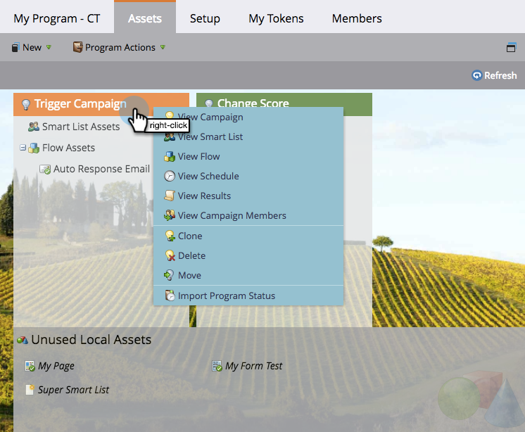
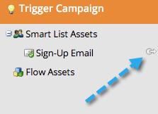

# Utilisation de l’onglet Ressources {#using-the-assets-tab}

La zone de travail des ressources est une représentation visuelle de votre programme par défaut ou d’événement. Vous pouvez l’utiliser pour ajouter des ressources locales et interagir avec des ressources existantes.

## Ajout d’Assets {#adding-assets}

Cliquez sur l’onglet **&#x200B;**&#x200B;dans le programme souhaité. Sélectionnez l’une des ressources ci-dessous et ajoutez-la à votre programme.

## Gestion du programme  {#manage-your-program}

Lorsqu’il existe des ressources dans votre programme, elles sont répertoriées ici.

| Orange | Campagne à déclencheur |
|---|---|
| Vert | Campagne par lot |

Vous pouvez cliquer avec le bouton droit de la souris sur l’en-tête si vous souhaitez interagir avec cette ressource.

>[!TIP]
>
>Effectuez un glisser-déposer pour réorganiser les colonnes de la ressource.

Les Assets qui ne sont pas locales à votre programme ressembleront à ceci :

L’onglet Ressources est un petit tableau de bord attrayant pour tout ce qui se trouve dans et référencé dans le programme.
