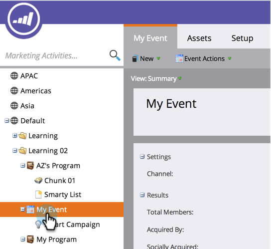

# Utiliser l’onglet Accueil du programme {#using-the-program-home-tab}

L’onglet d’accueil du programme vous donne une vue d’ensemble de ce qui se passe dans votre programme.

## Vue Résumé {#summary-view}

1. Accédez à **[!UICONTROL Activités marketing]**.

   

1. Sélectionnez un programme.

   

   >[!NOTE]
   >
   >Il s’agit de votre vue par défaut. Il fournit des informations sur vos paramètres, calendrier, résultats et statut du programme des membres.

1. Cliquez sur les éléments soulignés pour apporter des modifications ou afficher plus d’informations.

   

1. Cliquez sur **[!UICONTROL Exporter]** au bas du rapport Résumé à télécharger.

   

## Utilisé par la vue {#used-by-view}

1. Dans **[!UICONTROL Activités marketing]**, sélectionnez un programme.

   

1. Cliquez sur la liste déroulante **[!UICONTROL Affichage]**. Sélectionnez **[!UICONTROL Utilisé par]**.

   

   Cette vue indique les campagnes intelligentes utilisées.

   

## Vue Abonnement {#membership-view}

1. Dans **[!UICONTROL Activités marketing]**, sélectionnez un programme.

   

1. Cliquez sur la liste déroulante **[!UICONTROL Affichage]**. Sélectionnez **[!UICONTROL Abonnement]**.

   

   Vous voyez ici un graphique de l&#39;état des membres à mesure qu&#39;ils passent d&#39;un statut de programme à l&#39;autre.

   

   >[!NOTE]
   >
   >**[!UICONTROL Historique]** désigne toute personne qui a déjà suivi le programme, tandis que **[!UICONTROL Actuel]** inclut uniquement les personnes qui participent actuellement au programme.

   >[!MORELIKETHIS]
   >
   >[Présentation de l’appartenance à un programme](/help/marketo/product-docs/core-marketo-concepts/programs/creating-programs/understanding-program-membership.md){target="_blank"}
