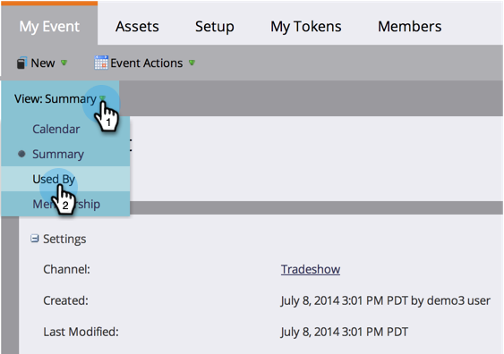

# Utilisation de l’onglet Accueil Programme {#using-the-program-home-tab}

L&#39;onglet programme d&#39;accueil vous donne une vue générale de ce qui se passe dans votre programme.

## Vue de résumé {#summary-view}

1. Accédez à Activités **** marketing.

   

1. Sélectionnez un programme.

   

   >[!NOTE]
   >
   >Il s’agit de votre vue par défaut. Il fournit des informations sur vos paramètres, votre planification, vos résultats et l&#39;état du Programme des membres.

   Cliquez sur les éléments soulignés pour apporter des modifications ou vue à d’autres informations.

   

   Cliquez sur Exporter au bas du résumé pour télécharger le rapport.

   

## Utilisé par Vue {#used-by-view}

1. Dans Activités marketing, sélectionnez un programme.

   

1. Cliquez sur la liste déroulante **Vue** . Sélectionnez **Utilisé par**.

   

   Cette vue présente les campagnes intelligentes utilisées.

   

## Vue d&#39;abonnement {#membership-view}

1. Dans Activités marketing, sélectionnez un programme.

   

1. Cliquez sur la liste déroulante **Vue** . Sélectionnez **Abonnement**.

   

   Vous pouvez ainsi obtenir un graphique indiquant où se trouvent les membres lorsqu’ils parcourent les états des programmes.

   

   >[!NOTE]
   >
   >**Historique** signifie toute personne qui a déjà traversé le programme, tandis que **Actuel** n&#39;inclut que les personnes actuellement sur le programme.

   >[!NOTE]
   >
   >**Articles connexes**
   >
   >    
   >    
   >    * [Comprendre l&#39;appartenance à un Programme](understanding-program-membership.md)

