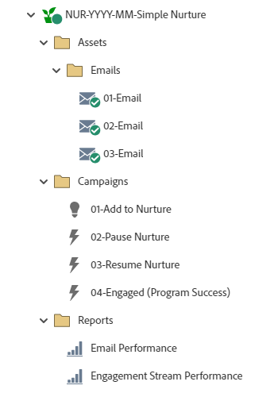

# NUR-AAAA-MM-Fidélisation simple {#nur-yyyy-mm-simple-nurture}

Il s’agit d’un exemple de programmes de formation simples, utilisant le programme d’engagement Marketo Engage, avec du contenu cadencé qui s’écoule au fil du temps vers votre base de données tout en utilisant des flux pour guider les enregistrements à travers les parcours en fonction du comportement.

Pour obtenir de l’aide sur la stratégie ou la personnalisation d’un programme, contactez l’équipe du compte Adobe ou rendez-vous sur la page [Adobe Professional Services](https://business.adobe.com/customers/consulting-services/main.html){target="_blank"}.

## Résumé du canal {#channel-summary}

<table style="table-layout:auto">
 <tbody>
  <tr>
   <th>Canal</th>
   <th>Statut d’abonnement</th>
   <th>Comportement d'analyse</th>
   <th>Type de programme</th>
  </tr>
  <tr>
   <td>Nurture</td>
   <td>01 - Membre
 02 - Engagé - Succès</td>
   <td>Inclusif</td>
   <td>Engagement</td>
  </tr>
 </tbody>
</table>

## Le programme contient les Assets suivantes {#program-contains-the-following-assets}

<table style="table-layout:auto">
 <tbody>
  <tr>
   <th>Type</th>
   <th>Nom du modèle</th>
   <th>Nom de la ressource</th>
  </tr>
  <tr>
   <td>E-mail</td>
   <td><a href="/help/marketo/product-docs/core-marketo-concepts/programs/program-library/quick-start-email-template.md" target="_blank">Modèle d’e-mail pour un démarrage rapide</a></td>
   <td>01 - E-mail</td>
  </tr>
   <tr>
   <td>E-mail</td>
   <td><a href="/help/marketo/product-docs/core-marketo-concepts/programs/program-library/quick-start-email-template.md" target="_blank">Modèle d’e-mail pour un démarrage rapide</a></td>
   <td>02 - E-mail</td>
  </tr>
   <tr>
   <td>E-mail</td>
   <td><a href="/help/marketo/product-docs/core-marketo-concepts/programs/program-library/quick-start-email-template.md" target="_blank">Modèle d’e-mail pour un démarrage rapide</a></td>
   <td>03 - E-mail</td>
  </tr>
  <tr>
   <td>Rapport local</td>
   <td> </td>
   <td>Performance des e-mails</td>
  </tr>
  <tr>
   <td>Rapport local</td>
   <td> </td>
   <td>Performance du stream d'engagement</td>
  </tr>
  <tr>
  <tr>
   <td>Campagne intelligente</td>
   <td> </td>
   <td>01 - Ajouter pour nourrir</td>
  </tr>
  <tr>
   <td>Campagne intelligente</td>
   <td> </td>
   <td>02 - Suspendre la maturation</td>
  </tr>
  <tr>
   <td>Campagne intelligente</td>
   <td> </td>
   <td>03 - Reprendre l'apprentissage</td>
  </tr>
  <tr>
   <td>Campagne intelligente</td>
   <td> </td>
   <td>04 - Engagé (Succès du programme)</td>
  </tr>
  <tr>
   <td>Dossier</td>
   <td> </td>
   <td>Assets - Contient toutes les ressources créatives
     (sous-dossiers pour les e-mails)</td>
  </tr>
  <tr>
   <td>Dossier</td>
   <td> </td>
   <td>Campagnes - Abrite toutes les campagnes intelligentes</td>
  </tr>
  <tr>
   <td>Dossier</td>
   <td> </td>
   <td>Rapports</td>
  </tr>
 </tbody>
</table>

## Mes jetons inclus {#my-tokens-included}

<table style="table-layout:auto">
 <tbody>
  <tr>
   <th>Type de jeton</th>
   <th>Nom du jeton</th>
   <th>Valeur</th>
  </tr>
  <tr>
   <td>Texte</td>
   <td><code>{{my.Email-FromAddress}}</code></td>
   <td>PlaceholderFrom.email@mydomain.com</td>
  </tr>
  <tr>
   <td>Texte</td>
   <td><code>{{my.Email-FromName}}</code></td>
   <td><code><--My From Name Here--></code></td>
  </tr>
  <tr>
   <td>Texte</td>
   <td><code>{{my.Email-ReplyToAddress}}</code></td>
   <td>reply-to.email@mydomain.com</td>
  </tr>
 </tbody>
</table>

## Règles de conflit {#conflict-rules}

* **Balises de programme**
   * Créer des balises dans cet abonnement - _Recommandé_
   * Ignorer

* **Modèle de page de destination portant le même nom**
   * Copier le modèle d&#39;origine
   * Utiliser le modèle de destination - _Recommandé_

* **Images du même nom**
   * Conserver les deux fichiers
   * Remplacer l&#39;élément dans cet abonnement - _Recommandé_

* **Modèles d’e-mail portant le même nom**
   * Conserver les deux modèles
   * Remplacer le modèle existant - _Recommandé_

## Meilleures pratiques {#best-practices}

* Envisagez de mettre à jour les modèles de votre programme importé afin d’utiliser les modèles de la marque actuelle, ou mettez à jour le nouveau modèle importé pour refléter votre marque en ajoutant un fragment de code ou les informations de logo/pied de page appropriées.

* Envisagez de mettre à jour la convention de nommage de cet exemple de programme pour l’aligner sur votre convention de nommage.

* Assurez-vous que vous avez mis en place des règles pour suspendre et reprendre votre cadence de maturation. Ces campagnes intelligentes doivent être activées ou planifiées avant l’activation du programme d’engagement.

>[!NOTE]
>
>N’oubliez pas de mettre à jour mes valeurs de jeton dans le modèle de programme et chaque fois que vous utilisez le programme, si nécessaire.

>[!TIP]
>
>N’oubliez pas d’activer la campagne « 04 - Engagé (succès du programme) » pour le suivi du succès ! Effectuez cette opération _avant_ l’envoi de vos e-mails.
