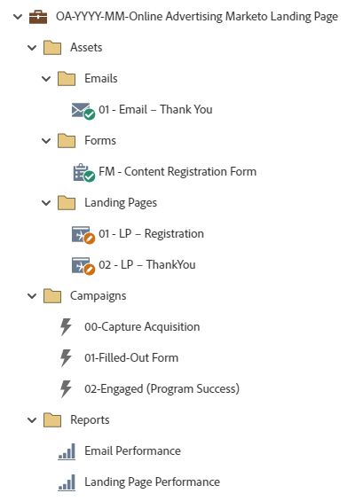

# OA-AAAA-MM-Publicité en ligne avec page de destination Marketo {#oa-yyyy-mm-online-advertising-marketo-landing-page}

Voici un exemple de programme de suivi publicitaire en ligne, comprenant une page de destination Marketo avec un formulaire d’enregistrement et utilisant un programme par défaut de Marketo. Le lien vers l’offre peut être affiché sur la page de remerciement, envoyé dans un e-mail de remerciement ou les deux.

Pour obtenir de l’aide sur la stratégie ou la personnalisation d’un programme, contactez l’équipe du compte Adobe ou rendez-vous sur la page [Adobe Professional Services](https://business.adobe.com/customers/consulting-services/main.html){target="_blank"}.

## Résumé du canal {#channel-summary}

<table style="table-layout:auto">
 <tbody>
  <tr>
   <th>Canal</th>
   <th>Statut d’abonnement</th>
   <th>Comportement d'analyse</th>
   <th>Type de programme</th>
  </tr>
  <tr>
   <td>Publicité en ligne</td>
   <td>01 - Membre
 02 - Engagé - Succès</td>
   <td>Inclusif</td>
   <td>Par défaut</td>
  </tr>
 </tbody>
</table>

## Le programme contient les Assets suivantes {#program-contains-the-following-assets}

<table style="table-layout:auto">
 <tbody>
  <tr>
   <th>Type</th>
   <th>Nom du modèle</th>
   <th>Nom de la ressource</th>
  </tr>
  <tr>
   <td>Form</td>
   <td> </td>
   <td>Enregistrement du contenu FM</td>
  </tr>
  <tr>
   <td>E-mail</td>
   <td><a href="/help/marketo/product-docs/core-marketo-concepts/programs/program-library/quick-start-email-template.md" target="_blank">Modèle d’e-mail pour un démarrage rapide</a></td>
   <td>01-E-Mail-Merci</td>
  </tr>
  <tr>
   <td>Page de destination</td>
   <td><a href="/help/marketo/product-docs/core-marketo-concepts/programs/program-library/quick-start-landing-page-template.md" target="_blank">Modèle de programme de démarrage rapide</a></td>
   <td>01 - LP - Inscription</td>
  </tr>
   <tr>
   <td>Page de destination</td>
   <td><a href="/help/marketo/product-docs/core-marketo-concepts/programs/program-library/quick-start-landing-page-template.md" target="_blank">Modèle de programme de démarrage rapide</a></td>
   <td>02 - LP - Merci</td>
  </tr>
   <tr>
   <td>Rapport local</td>
   <td> </td>
   <td>Performance des e-mails</td>
  </tr>
  <tr>
   <td>Rapport local</td>
   <td> </td>
   <td>Performance de la page de destination</td>
  </tr>
  <tr>
   <td>Campagne intelligente</td>
   <td> </td>
   <td>00 - Programme d'acquisition des captures</td>
  </tr>
  <tr>
   <td>Campagne intelligente</td>
   <td> </td>
   <td>01 - Formulaire rempli</td>
  </tr>
  <tr>
   <td>Campagne intelligente</td>
   <td> </td>
   <td>02 - Engagé (Succès du programme)</td>
  </tr>
  <tr>
   <td>Dossier</td>
   <td> </td>
   <td>Assets : héberge toutes les ressources de création
 (sous-dossiers pour les e-mails et les pages de destination)  </td>
  </tr>
  <tr>
   <td>Dossier</td>
   <td> </td>
   <td>Campagnes - Abrite toutes les campagnes intelligentes</td>
  </tr>
  <tr>
   <td>Dossier</td>
   <td> </td>
   <td>Rapports</td>
  </tr>
 </tbody>
</table>

## Mes jetons inclus {#my-tokens-included}

<table style="table-layout:auto">
 <tbody>
  <tr>
   <th>Type de jeton</th>
   <th>Nom du jeton</th>
   <th>Valeur</th>
  </tr>
  <tr>
   <td>Texte complet</td>
   <td><code>{{my.Content-Description}}</code></td>
   <td>Double-cliquer pour plus de détails
 <code><--My Content Description Here--></code>
 Modifiez cette description de contenu au niveau du programme, sous l’onglet Mes jetons .
 Vous apprendrez :
<li>Puce 1</li>
<li>Puce 2</li>
<li>Puce 3</li></td>
  </tr>
  <tr>
   <td>Texte</td>
   <td><code>{{my.Content-Title}}</code></td>
   <td><code><--My Content Title Here--></code></td>
  </tr>
  <tr>
   <td>Texte</td>
   <td><code>{{my.Content-Type}}</code></td>
   <td><code><--My Content Type Here--></code></td>
  </tr>
  <tr>
   <td>Texte</td>
   <td><code>{{my.Content-URL}}</code></td>
   <td>my.ContentURL?without=http://</td>
  </tr>
  <tr>
   <td>Texte</td>
   <td><code>{{my.Email-FromAddress}}</code></td>
   <td>PlaceholderFrom.email@mydomain.com</td>
  </tr>
  <tr>
   <td>Texte</td>
   <td><code>{{my.Email-FromName}}</code></td>
   <td><code><--My From Name Here--></code></td>
  </tr>
  <tr>
   <td>Texte</td>
   <td><code>{{my.Email-ReplyToAddress}}</code></td>
   <td>reply-to.email@mydomain.com</td>
  </tr>
  <tr>
   <td>Texte</td>
   <td><code>{{my.PageURL-ThankYou}}</code></td>
   <td>My.ThanksYouPageURL?without the http://</td>
  </tr>
 </tbody>
</table>

CAPTURE D’ÉCRAN DU PROGRAMME

## Règles de conflit {#conflict-rules}

* **Balises de programme**
   * Créer des balises dans cet abonnement - _Recommandé_
   * Ignorer

* **Modèle de page de destination portant le même nom**
   * Copier le modèle d&#39;origine
   * Utiliser le modèle de destination - _Recommandé_

* **Images du même nom**
   * Conserver les deux fichiers
   * Remplacer l&#39;élément dans cet abonnement - _Recommandé_

* **Modèles d’e-mail portant le même nom**
   * Conserver les deux modèles
   * Remplacer le modèle existant - _Recommandé_

CAPTURE D’ÉCRAN DES RÈGLES DE CONFLIT

## Meilleures pratiques {#best-practices}

* Après l’importation du programme de contenu, déplacez le formulaire d’une ressource locale vers une ressource globale située dans Design Studio.
   * Réduire le nombre de formulaires et utiliser davantage de ressources globales à partir de Design Studio permet une plus grande évolutivité dans la conception de vos programmes et la gouvernance administrative. Il offre également une certaine flexibilité dans les mises à jour de conformité régulières pour les champs, la langue d’accord préalable, etc.

* Envisagez de mettre à jour les modèles de votre programme importé afin d’utiliser les modèles de la marque actuelle, ou mettez à jour le nouveau modèle importé pour refléter votre marque en ajoutant un fragment de code ou les informations de logo/pied de page appropriées.

* Utilisez les balises de programme pour filtrer les rapports selon vos différentes sources d’Advertising en ligne.

* Envisagez de mettre à jour la convention de nommage de cet exemple de programme pour l’aligner sur votre convention de nommage.

>[!NOTE]
>
>N’oubliez pas de mettre à jour mes valeurs de jeton dans le modèle de programme et chaque fois que vous utilisez le programme, si nécessaire.

>[!TIP]
>
>Activez la campagne « 02 - Engagé (succès du programme) » pour suivre les succès avant que votre formulaire ne soit actif et que les e-mails ne soient envoyés.

>[!IMPORTANT]
>
>Mes jetons qui font référence à une URL ne peuvent pas contenir les adresses http:// ou https://. Autrement, le lien ne fonctionnera pas correctement dans la ressource.
