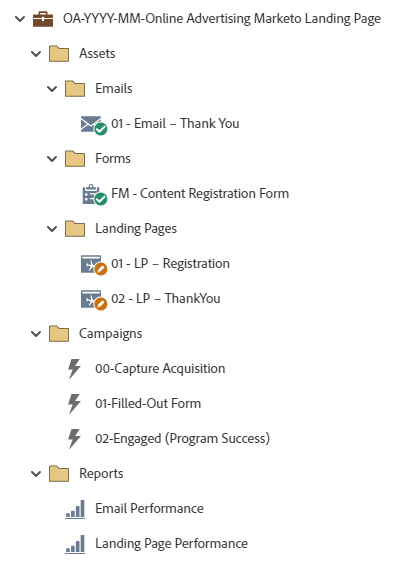

# Page d’entrée Marketo Advertising en ligne OA-AAAA-MM {#oa-yyyy-mm-online-advertising-marketo-landing-page}

Il s’agit d’un exemple de programme de suivi des publicités en ligne, notamment une page d’entrée Marketo avec formulaire d’enregistrement et utilisant un programme Marketo par défaut. Le lien vers l’offre peut être affiché sur la page de remerciement, envoyé dans un email de remerciement, ou les deux.

Pour obtenir de l’aide sur la stratégie ou personnaliser un programme, contactez l’équipe chargée du compte Adobe ou rendez-vous sur la page [Adobe Professional Services](https://business.adobe.com/customers/consulting-services/main.html){target="_blank"} .

## Résumé du canal {#channel-summary}

<table style="table-layout:auto"> 
 <tbody> 
  <tr> 
   <th>Canal</th> 
   <th>État d’appartenance</th>
   <th>Comportement d'analyse</th>
   <th>Type de programme</th>
  </tr> 
  <tr> 
   <td>Publicité en ligne</td> 
   <td>01 - Membre 
 02 - Engagé - Succès</td>
   <td>Inclusif</td>
   <td>Par défaut</td>
  </tr>
 </tbody> 
</table>

## Le programme contient l’Assets suivante {#program-contains-the-following-assets}

<table style="table-layout:auto"> 
 <tbody> 
  <tr> 
   <th>Type</th> 
   <th>Nom du modèle</th>
   <th>Nom de la ressource</th>
  </tr> 
  <tr> 
   <td>Formulaire</td> 
   <td> </td>
   <td>Enregistrement de contenu FM</td>
  </tr>
  <tr> 
   <td>E-mail</td> 
   <td><a href="/help/marketo/product-docs/core-marketo-concepts/programs/program-library/quick-start-email-template.md" target="_blank">Modèle de courrier électronique de démarrage rapide</a></td>
   <td>01-Email-Thank You</td>
  </tr>
  <tr> 
   <td>Page de destination</td> 
   <td><a href="/help/marketo/product-docs/core-marketo-concepts/programs/program-library/quick-start-landing-page-template.md" target="_blank">Modèle LP de démarrage rapide</a></td>
   <td>01 - LP - Enregistrement</td>
  </tr>
   <tr> 
   <td>Page de destination</td> 
   <td><a href="/help/marketo/product-docs/core-marketo-concepts/programs/program-library/quick-start-landing-page-template.md" target="_blank">Modèle LP de démarrage rapide</a></td>
   <td>02 - LP - Merci</td>
  </tr>
   <tr> 
   <td>Rapport local</td> 
   <td> </td>
   <td>Performance des e-mails</td>
  </tr>
  <tr> 
   <td>Rapport local</td> 
   <td> </td>
   <td>Performance de la page de destination</td>
  </tr>
  <tr> 
   <td>Campagne intelligente</td> 
   <td> </td>
   <td>00 - Programme d’acquisition de capture</td>
  </tr>
  <tr> 
   <td>Campagne intelligente</td> 
   <td> </td>
   <td>01 - Formulaire rempli</td>
  </tr>
  <tr> 
   <td>Campagne intelligente</td> 
   <td> </td>
   <td>02 - Engagé (succès du programme)</td>
  </tr>
  <tr> 
   <td>Dossier</td> 
   <td> </td>
   <td>Assets : héberge toutes les ressources créatives. 
  (sous-dossiers pour les emails et les landing pages)  </td>
  </tr>
  <tr> 
   <td>Dossier</td> 
   <td> </td>
   <td>Campagnes : héberge toutes les campagnes dynamiques.</td>
  </tr>
  <tr> 
   <td>Dossier</td> 
   <td> </td>
   <td>Rapports</td>
  </tr>
 </tbody> 
</table>

## Mes jetons inclus {#my-tokens-included}

<table style="table-layout:auto"> 
 <tbody> 
  <tr> 
   <th>Type de jeton</th> 
   <th>Nom du jeton</th>
   <th>Valeur</th>
  </tr> 
  <tr> 
   <td>Texte complet</td> 
   <td><code>{{my.Content-Description}}</code></td>
   <td>Double-cliquez pour plus de détails  
 <code><--My Content Description Here--></code> 
 Modifiez cette description de contenu au niveau du programme, sous l’onglet Mes jetons . 
 Vous apprendrez : 
<li>Puce 1</li>
<li>Puce 2</li>
<li>Puce 3</li></td>
  </tr>
  <tr> 
   <td>Texte</td> 
   <td><code>{{my.Content-Title}}</code></td>
   <td><code><--My Content Title Here--></code></td>
  </tr>
  <tr> 
   <td>Texte</td> 
   <td><code>{{my.Content-Type}}</code></td>
   <td><code><--My Content Type Here--></code></td>
  </tr>
  <tr> 
   <td>Texte</td> 
   <td><code>{{my.Content-URL}}</code></td>
   <td>my.ContentURL?without=http://</td>
  </tr>
  <tr> 
   <td>Texte</td> 
   <td><code>{{my.Email-FromAddress}}</code></td>
   <td>PlaceholderFrom.email@mydomain.com</td>
  </tr>
  <tr> 
   <td>Texte</td> 
   <td><code>{{my.Email-FromName}}</code></td>
   <td><code><--My From Name Here--></code></td>
  </tr>
  <tr> 
   <td>Texte</td> 
   <td><code>{{my.Email-ReplyToAddress}}</code></td>
   <td>reply-to.email@mydomain.com</td>
  </tr>
  <tr> 
   <td>Texte</td> 
   <td><code>{{my.PageURL-ThankYou}}</code></td>
   <td>My.ThankYouPageURL?sans le http://</td>
  </tr>
 </tbody> 
</table>

CAPTURE D’ÉCRAN DU PROGRAMME

## Règles de conflit {#conflict-rules}

* **Balises de programme**
   * Créer des balises dans cet abonnement - _Recommandé_
   * Ignorer

* **Modèle de page d’entrée avec le même nom**
   * Copier le modèle d&#39;origine
   * Utiliser le modèle de destination - _Recommandé_

* **Images du même nom**
   * Conserver les deux fichiers
   * Remplacer un élément de cet abonnement - _Recommandé_

* **Modèles d&#39;email portant le même nom**
   * Conserver les deux modèles
   * Remplacer le modèle existant - _Recommandé_

CAPTURE D&#39;ÉCRAN DES RÈGLES DE CONFLIT

## Meilleures pratiques {#best-practices}

* Après l’importation du programme de contenu, déplacez le formulaire d’une ressource locale vers une ressource globale située dans Design Studio.
   * La réduction du nombre de formulaires et l’utilisation de ressources plus globales à partir de Design Studio vous permettent d’accroître l’évolutivité de la conception de votre programme et de la gouvernance administrative. Il offre également une certaine flexibilité quant aux mises à jour régulières de conformité pour les champs, la langue d’inscription, etc.

* Envisagez de mettre à jour les modèles de votre programme importé afin d’utiliser les modèles de marque actuels ou de mettre à jour le modèle nouvellement importé pour refléter votre marque en ajoutant un fragment de code ou vos informations de logo/pied de page appropriées.

* Utilisez les balises de programme pour filtrer les rapports selon vos différentes sources d’Advertising en ligne.

* Envisagez de mettre à jour la convention d’affectation des noms de cet exemple de programme pour vous aligner sur votre convention d’affectation des noms.

>[!NOTE]
>
>Pensez à mettre à jour les valeurs de mon jeton dans le modèle de programme et chaque fois que vous utilisez le programme, selon les besoins.

>[!TIP]
>
>N’oubliez pas d’activer la campagne &quot;02 - Participé (Succès du programme)&quot; pour suivre le succès ! Effectuez cette opération _avant_ que votre formulaire soit actif et que les courriers électroniques soient envoyés.

>[!IMPORTANT]
>
>Les jetons qui font référence à une URL ne peuvent pas contenir les caractères http:// ou https:// ; dans le cas contraire, le lien ne fonctionnera pas correctement dans la ressource.
