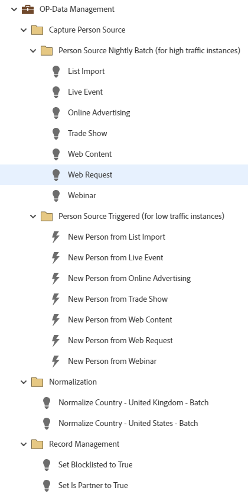

# Gestion des données OP {#op-data-management}

Il s’agit d’un exemple de processus simples de bonnes pratiques de gestion opérationnelle des données utilisant un programme par défaut, afin de vous aider à gérer la cohérence des données pour les enregistrements dans votre base de données de Marketo Engage.

Pour obtenir de l’aide sur la stratégie ou personnaliser un programme, contactez l’équipe chargée du compte Adobe ou rendez-vous sur la page [Adobe Professional Services](https://business.adobe.com/customers/consulting-services/main.html){target="_blank"} .

## Résumé du canal {#channel-summary}

<table style="table-layout:auto"> 
 <tbody> 
  <tr> 
   <th>Canal</th> 
   <th>État d’appartenance</th>
   <th>Comportement d'analyse</th>
   <th>Type de programme</th>
  </tr> 
  <tr> 
   <td>Opérationnel</td> 
   <td>01-Member</td>
   <td>Opérationnel</td>
   <td>Par défaut</td>
  </tr>
 </tbody> 
</table>

## Le programme contient l’Assets suivante {#program-contains-the-following-assets}

<table style="table-layout:auto"> 
 <tbody> 
  <tr> 
   <th>Type</th> 
   <th>Nom du modèle</th>
   <th>Nom de la ressource</th>
  </tr>
  <tr> 
   <td>Campagne intelligente</td> 
   <td> </td>
   <td>Pays normalisé - États-Unis</td>
  </tr>
  <tr> 
   <td>Campagne intelligente</td> 
   <td> </td>
   <td>Pays normalisé - Royaume-Uni</td>
  </tr>
  <tr> 
   <td>Campagne intelligente</td> 
   <td> </td>
   <td>Défini Placé sur la liste bloquée sur True</td>
  </tr>
  <tr> 
   <td>Campagne intelligente</td> 
   <td> </td>
   <td>Définir est partenaire sur vrai</td>
  </tr>
  <tr> 
   <td>Campagne intelligente</td> 
   <td> </td>
   <td>Importer une liste</td>
  </tr>
  <tr> 
   <td>Campagne intelligente</td> 
   <td> </td>
   <td>Évènement en direct</td>
  </tr>
  <tr> 
   <td>Campagne intelligente</td> 
   <td> </td>
   <td>Publicité en ligne</td>
  </tr>
  <tr> 
   <td>Campagne intelligente</td> 
   <td> </td>
   <td>Salon professionnel</td>
  </tr>
  <tr> 
   <td>Campagne intelligente</td> 
   <td> </td>
   <td>Contenu Web</td>
  </tr>
  <tr> 
   <td>Campagne intelligente</td> 
   <td> </td>
   <td>Demande sur le Web</td>
  </tr>
  <tr> 
   <td>Campagne intelligente</td> 
   <td> </td>
   <td>Webinaire</td>
  </tr>
  <tr> 
   <td>Campagne intelligente</td> 
   <td> </td>
   <td>Nouvelle personne à partir de l’importation de liste</td>
  </tr>
  <tr> 
   <td>Campagne intelligente</td> 
   <td> </td>
   <td>Nouvelle personne d’un événement en direct</td>
  </tr>
  <tr> 
   <td>Campagne intelligente</td> 
   <td> </td>
   <td>Nouvelle personne d’Advertising en ligne</td>
  </tr>
  <tr> 
   <td>Campagne intelligente</td> 
   <td> </td>
   <td>Nouvelle personne du Salon professionnel</td>
  </tr>
   <tr> 
   <td>Campagne intelligente</td> 
   <td> </td>
   <td>Nouvelle personne à partir du contenu web</td>
  </tr>
   <tr> 
   <td>Campagne intelligente</td> 
   <td> </td>
   <td>Nouvelle personne à partir d’une requête web</td>
  </tr>
   <tr> 
   <td>Campagne intelligente</td> 
   <td> </td>
   <td>Nouvelle personne du webinaire</td>
  </tr>
  <tr> 
   <td>Dossier</td> 
   <td> </td>
   <td>Lot de nuit de la personne Source (pour les instances à trafic élevé)</td>
  </tr>
  <tr> 
   <td>Dossier</td> 
   <td> </td>
   <td>Source de personne déclenchée (pour les instances de faible trafic)</td>
  </tr>
  <tr> 
   <td>Dossier</td> 
   <td> </td>
   <td>Capture de la personne Source</td>
  </tr>
  <tr> 
   <td>Dossier</td> 
   <td> </td>
   <td>Normalisation</td>
  </tr>
  <tr> 
   <td>Dossier</td> 
   <td> </td>
   <td>Gestion des enregistrements</td>
  </tr>
  <tr> 
   <td>Dossier</td> 
   <td> </td>
   <td>Liste de blocage</td>
  </tr>
 </tbody> 
</table>

## Règles de conflit {#conflict-rules}

* **Balises de programme**
   * Créer des balises dans cet abonnement - _Recommandé_
   * Ignorer

* **Modèle de page d’entrée avec le même nom**
   * Copier le modèle d’origine - _Recommandé_
   * Utiliser le modèle de destination

* **Images du même nom**
   * Conserver les deux fichiers - _Recommandé_
   * Remplacer l&#39;élément de cet abonnement

* **Modèles d&#39;email portant le même nom**
   * Conserver les deux modèles - _Recommandé_
   * Remplacer le modèle existant

## Meilleures pratiques {#best-practices}

* Chaque campagne créée a pour but de servir d’exemple sur la génération des bonnes pratiques et non de répondre à vos cas d’utilisation. N’oubliez pas de mettre à jour les campagnes intelligentes afin de répondre à vos problèmes spécifiques et à vos défis en matière de données.

* Envisagez de mettre à jour la convention d’affectation des noms de cet exemple de programme pour vous aligner sur votre convention d’affectation des noms.
