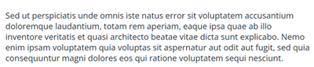
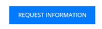

# Modèle d’e-mail pour un démarrage rapide {#quick-start-email-template}

Certains des programmes de démarrage de la bibliothèque de référence Marketo Engage contiennent un modèle d’e-mail simple, facile à utiliser et personnalisable qui permet la création rapide d’e-mails dans un certain nombre de cas d’utilisation marketing.

L’éditeur d’e-mail de Marketo Engage est fourni avec des fonctions qui vous permettent de modifier la disposition et le contenu de vos e-mails.

* **Modules** : blocs de contenu glissables/déposables qui sont codés dans le modèle. Ils peuvent être réorganisés et dupliqués.

* **Éléments de texte** : vous pouvez utiliser l’éditeur pour mettre à jour la copie, modifier les styles de police ou ajouter des liens.

* **Éléments d’image** : tout comme les éléments de texte, les images peuvent être permutées, associées et redimensionnées.

* **Variables** : lorsqu’un module est sélectionné, les variables s’affichent dans la partie droite de l’éditeur. Ils peuvent être utilisés pour ajuster les attributs du module qui ne sont pas facilement modifiables via des éléments d’image ou de texte.

Pour obtenir de l’aide sur la stratégie ou la personnalisation d’un programme, contactez l’équipe du compte Adobe ou rendez-vous sur la page [Adobe Professional Services](https://business.adobe.com/customers/consulting-services/main.html){target="_blank"}.

## Résumé des modules {#modules-summary}

### Module Logo {#logo-module}

* Inclut un élément image pour mettre à jour le logo
* Inclut des variables à contrôler :
   * Marge intérieure supérieure du module
   * Marge intérieure inférieure du module
   * Couleur d’arrière-plan du module
   * Alignement du logo
* 

### Module Image {#image-module}

* Inclut un élément image pour mettre à jour l’image
* Inclut des variables à contrôler :
   * Marge intérieure supérieure du module
   * Marge intérieure inférieure du module
   * Couleur d’arrière-plan du module
* 

### Headline Module {#headline-module}

* Inclut un élément texte pour mettre à jour le titre
* Inclut des variables à contrôler :
   * Marge intérieure supérieure du module
   * Marge intérieure inférieure du module
   * Couleur d’arrière-plan du module
   * Taille de police du titre (cela peut également être modifié dans l’éditeur de texte enrichi)
   * Couleur de police du titre (vous pouvez également la modifier dans l’éditeur de texte enrichi)
   * Alignement du texte de titre (vous pouvez également le modifier dans l’éditeur de texte enrichi)
* 

### Module Subheadline {#subheadline-module}

* Inclut un élément texte pour mettre à jour le sous-titre
* Inclut des variables à contrôler :
   * Marge intérieure supérieure du module
   * Marge intérieure inférieure du module
   * Couleur d’arrière-plan du module
   * Taille de police du sous-titre (peut également être modifié dans l’éditeur de texte enrichi)
   * Couleur de police du sous-titre (peut également être modifiée dans l’éditeur de texte enrichi)
   * Alignement du texte du sous-titre (peut également être modifié dans l’éditeur de texte enrichi)
* 

### Module de texte libre {#free-text-module}

* Inclut un élément de texte pour mettre à jour le texte
* Inclut des variables à contrôler :
   * Marge intérieure supérieure du module
   * Marge intérieure inférieure du module
   * Couleur d’arrière-plan du module
   * Taille de police du texte (vous pouvez également la modifier dans l’éditeur de texte enrichi)
   * Couleur de police du texte (vous pouvez également la modifier dans l’éditeur de texte enrichi)
   * Alignement du texte (vous pouvez également l’éditer dans l’éditeur de texte enrichi)
* 

### Module CTA {#cta-module}

* Inclut des variables à contrôler :
   * Marge intérieure supérieure du module
   * Marge intérieure inférieure du module
   * Couleur d’arrière-plan du module
   * Couleur du texte CTA
   * Couleur d’arrière-plan CTA
   * Couleur de bordure CTA
   * Rayon de bordure CTA (pour arrondir les boutons - **Remarque** : cette fonctionnalité ne fonctionne pas dans les clients de messagerie Microsoft Outlook)
   * URL CTA
   * Texte CTA
   * Alignement de CTA
* 

### Module diviseur {#divider-module}

* Inclut des variables à contrôler :
   * Marge intérieure supérieure du module
   * Marge intérieure inférieure du module
   * Couleur d’arrière-plan du module
   * Couleur du séparateur
   * Hauteur du séparateur (en pixels)
   * Largeur du séparateur (en %)
* 

### Module Pied de page {#footer-module}

* Élément de texte qui peut être utilisé pour échanger ou lier des icônes sociales
* Elément texte pour mettre à jour la langue du pied de page
* Inclut des variables à contrôler :
   * Marge intérieure supérieure du module
   * Marge intérieure inférieure du module
   * Couleur d’arrière-plan du module
   * Couleur du texte
   * Alignement du contenu
* 
