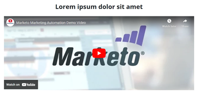

# Modèle de page d’entrée de démarrage rapide {#quick-start-landing-page-template}

Certains programmes de démarrage de la bibliothèque de référence des Marketo Engage contiennent un modèle de page d’entrée simple, facile à utiliser et personnalisable qui permet la création rapide de pages d’entrée dans plusieurs cas d’utilisation marketing.

>[!TIP]
>
>En savoir plus sur [Modèles de page d’entrée guidés](/help/marketo/product-docs/demand-generation/landing-pages/landing-page-templates/create-a-guided-landing-page-template.md){target="_blank"}

Pour obtenir de l’aide sur la stratégie ou personnaliser un programme, contactez l’équipe Compte d’Adobe ou rendez-vous sur la page [Adobe Professional Services](https://business.adobe.com/customers/consulting-services/main.html){target="_blank"} page.

## Résumé des sections {#sections-summary}

### Section Logo {#logo-section}

* Inclut un élément image pour remplacer le logo par une autre image.
* Inclut des variables à modifier :
   * Taille du logo
   * Alignement du logo
   * Couleur d’arrière-plan de la section Logo
   * Afficher ou masquer la section
   * Marge intérieure supérieure de la section
   * Marge intérieure inférieure de la section
* 

### Section Image {#image-section}

* Inclut un élément image pour remplacer le logo par une autre image.
* Inclut des variables à modifier :
   * Lien d’image de bannière
   * Largeur de la bannière : l’un des commutateurs en bas à droite vous permet d’afficher l’image sous la forme de la largeur du conteneur de contenu ou de celle de l’ensemble du navigateur.
   * Afficher ou masquer la section
* 

### Texte à 2 colonnes à gauche, Formulaire à section droite {#two-col-left-form-right}

* Elément de texte de titre pour mettre à jour la copie de titre
* Elément de texte de paragraphe pour mettre à jour la copie de paragraphe
* Elément de formulaire à ajouter dans un formulaire
* Elément de texte sous le formulaire pour modifier le texte et les liens de la politique de confidentialité
* Variables à modifier : couleur d’arrière-plan de la section
   * Couleur d’arrière-plan directement derrière le formulaire
   * Rayon de bordure de la zone autour du formulaire (ce qui permet d’obtenir des coins incurvés ou, s’il est défini sur &quot;0&quot;, des coins carrés)
   * Afficher ou masquer toute la section
   * Afficher ou masquer uniquement le formulaire (masquer le formulaire entraîne le remplissage de la largeur de la page par le texte de la colonne de gauche. Cela peut être utilisé pour une page de remerciement ou de confirmation où un formulaire n’est pas présent.)
   * Afficher ou masquer le texte de la politique de confidentialité
* 

### Section vidéo {#video-section}

* Elément de texte pour mettre à jour le texte du titre
* Variables à modifier :
   * Couleur d’arrière-plan de la section
   * Code incorporé vidéo
   * Afficher/masquer le titre d’une vidéo
   * Afficher/masquer une vidéo
* 

### Section Pied de page {#footer-section}

* Elément Texte pour éditer le contenu dans la colonne de gauche
* Elément de texte permettant de mettre à jour les icônes sociales (les icônes utilisent la police FontAwesome plutôt que les images, mais elles peuvent être remplacées par des images).
* Variables à modifier :
   * Couleur d’arrière-plan de la section
   * Couleur des icônes sociales
   * Afficher/masquer la section
* 

### Variables supplémentaires {#additional-variables}

* **Rayon de la bordure du bouton**: ajuste le bouton de formulaire pour qu’il soit arrondi ou rectangulaire
* **Couleur du bouton**: met à jour la couleur du bouton sur le formulaire.
* **Couleur de survol du bouton**: modifie la couleur de l’état de survol du bouton sur le formulaire.
* **Couleur du lien**: met à jour la couleur des liens sur toute la page
* **Interlettrage des bords supérieurs des sections**: ajoute de l’espace au-dessus de chaque section, à l’exception de la section logo ;
* **Interlettrage de la section inférieure**: ajoute de l’espace sous chaque section, à l’exception de la section logos ;
