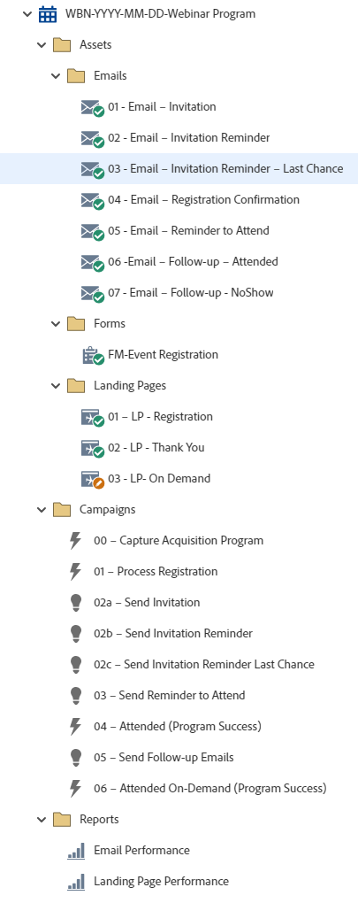

# Programme WBN-AAAA-MM-JJ-Webinaire {#wbn-yyyy-mm-dd-webinar-program}

Il s’agit d’un exemple de programme webinaire avec gestion de l’enregistrement, trois courriers électroniques d’invitation, rappels à suivre et courriers électroniques de relance utilisant un programme d’événement de Marketo Engage.

Pour obtenir de l’aide sur la stratégie ou personnaliser un programme, contactez l’équipe Compte d’Adobe ou rendez-vous sur la page [Adobe Professional Services](https://business.adobe.com/customers/consulting-services/main.html){target="_blank"} page.

## Résumé du canal {#channel-summary}

<table style="table-layout:auto"> 
 <tbody> 
  <tr> 
   <th>Canal</th> 
   <th>État d’appartenance</th>
   <th>Comportement d’analyse</th>
   <th>Type de programme</th>
  </tr> 
  <tr> 
   <td>Événement</td> 
   <td>01 - Invité 
    02 - Sur liste blanche
    03 - Inscrits
    04 - Aucun affichage
    05 - Participé - Succès
    06 - Participé à On-Demand - Succès</td>
   <td>Inclusif</td>
   <td>Événement
   
(Intégration : événement avec webinaire)</td>
  </tr>
 </tbody> 
</table>

## Le programme contient les ressources suivantes {#program-contains-the-following-assets}

<table style="table-layout:auto"> 
 <tbody> 
  <tr> 
   <th>Type</th> 
   <th>Nom du modèle</th>
   <th>Nom de la ressource</th>
  </tr> 
  <tr> 
   <td>E-mail</td> 
   <td><a href="/help/marketo/product-docs/core-marketo-concepts/programs/program-library/quick-start-email-template.md" target="_blank">Modèle de courrier électronique de démarrage rapide</a></td>
   <td>01 - Email - Invitation</td>
  </tr>
   <tr> 
   <td>E-mail</td> 
   <td><a href="/help/marketo/product-docs/core-marketo-concepts/programs/program-library/quick-start-email-template.md" target="_blank">Modèle de courrier électronique de démarrage rapide</a></td>
   <td>02 - Email - Rappel d’invitation</td>
  </tr>
   <tr> 
   <td>E-mail</td> 
   <td><a href="/help/marketo/product-docs/core-marketo-concepts/programs/program-library/quick-start-email-template.md" target="_blank">Modèle de courrier électronique de démarrage rapide</a></td>
   <td>03 - Email - Rappel d’invitation - Dernière chance</td>
  </tr>
  <tr> 
   <td>E-mail</td> 
   <td><a href="/help/marketo/product-docs/core-marketo-concepts/programs/program-library/quick-start-email-template.md" target="_blank">Modèle de courrier électronique de démarrage rapide</a></td>
   <td>04 - Email - Confirmation d'enregistrement</td>
  </tr>
  <tr> 
   <td>E-mail</td> 
   <td><a href="/help/marketo/product-docs/core-marketo-concepts/programs/program-library/quick-start-email-template.md" target="_blank">Modèle de courrier électronique de démarrage rapide</a></td>
   <td>05 - Email - Rappel à participer</td>
  </tr>
  <tr> 
   <td>E-mail</td> 
   <td><a href="/help/marketo/product-docs/core-marketo-concepts/programs/program-library/quick-start-email-template.md" target="_blank">Modèle de courrier électronique de démarrage rapide</a></td>
   <td>06 - Email - Suivi - Participé</td>
  </tr>
  <tr> 
   <td>E-mail</td> 
   <td><a href="/help/marketo/product-docs/core-marketo-concepts/programs/program-library/quick-start-email-template.md" target="_blank">Modèle de courrier électronique de démarrage rapide</a></td>
   <td>07 - Email - relance - pas de programme </td>
  </tr>
  <tr>
  <tr> 
   <td>Formulaire</td> 
   <td> </td>
   <td>Enregistrement FM-Event</td>
  </tr>
  <tr> 
   <td>Page de destination</td> 
   <td><a href="/help/marketo/product-docs/core-marketo-concepts/programs/program-library/quick-start-landing-page-template.md" target="_blank">Modèle LP de démarrage rapide</a></td>
   <td>01 - LP - Enregistrement</td>
  </tr>
  <tr> 
   <td>Page de destination</td> 
   <td><a href="/help/marketo/product-docs/core-marketo-concepts/programs/program-library/quick-start-landing-page-template.md" target="_blank">Modèle LP de démarrage rapide</a></td>
   <td>02 - LP - Merci</td>
  </tr>
  <tr> 
   <td>Page de destination</td> 
   <td><a href="/help/marketo/product-docs/core-marketo-concepts/programs/program-library/quick-start-landing-page-template.md" target="_blank">Modèle LP de démarrage rapide</a></td>
   <td>03 - LP - On Demand</td>
  </tr>
  <tr> 
   <td>Rapport local</td> 
   <td> </td>
   <td>Envoyer la performance par e-mail</td>
  </tr>
   <tr> 
   <td>Rapport local</td> 
   <td> </td>
   <td>Performance page de destination </td>
  </tr>
  <tr> 
   <td>Campagne intelligente</td> 
   <td> </td>
   <td>00 - Programme d’acquisition de capture</td>
  </tr>
  <tr> 
   <td>Campagne intelligente</td> 
   <td> </td>
   <td>01 - Enregistrements de processus</td>
  </tr>
   <tr> 
   <td>Campagne intelligente</td> 
   <td> </td>
   <td>02a - Envoyer une invitation</td>
  </tr>
   <tr> 
   <td>Campagne intelligente</td> 
   <td> </td>
   <td>02b - Envoyer le rappel d’invitation</td>
  </tr>
   <tr> 
   <td>Campagne intelligente</td> 
   <td> </td>
   <td>02c - Envoyer le rappel d’invitation la dernière chance</td>
  </tr>
  <tr> 
   <td>Campagne intelligente</td> 
   <td> </td>
   <td>03 - Envoyer le rappel pour participer</td>
  </tr>
  <tr> 
   <td>Campagne intelligente</td> 
   <td> </td>
   <td>04 - Envoi d’emails de relance</td>
  </tr>
  <tr> 
   <td>Campagne intelligente</td> 
   <td> </td>
   <td>05 - Participation On-Demand (succès du programme)</td>
  </tr>
  <tr> 
   <td>Dossier</td> 
   <td> </td>
   <td>Ressources : héberge toutes les ressources créatives 
 (sous-dossiers pour Email, Landing Pages et Forms)</td>
  </tr>
  <tr> 
   <td>Dossier</td> 
   <td> </td>
   <td>Campagnes : héberge toutes les campagnes dynamiques.</td>
  </tr>
  <tr> 
   <td>Dossier</td> 
   <td> </td>
   <td>Rapports  </td>
  </tr>
 </tbody> 
</table>

## Mes jetons inclus {#my-tokens-included}

<table style="table-layout:auto"> 
 <tbody> 
  <tr> 
   <th>Type de jeton</th> 
   <th>Nom du jeton</th>
   <th>Valeur</th>
  </tr>
  <tr> 
   <td>Fichier du calendrier</td> 
   <td><code>{{my.AddToCalendar}}</code></td>
   <td>Double-cliquer pour plus de détails</td>
  </tr>
  <tr> 
   <td>Texte</td> 
   <td><code>{{my.DownloadURL-PresentationSlides}}</code></td>
   <td>my.DownloadURL?without=http:// </td>
  </tr>
  <tr> 
   <td>Texte</td> 
   <td><code>{{my.Email-FromAddress}}</code></td>
   <td>PlaceholderFrom.email@mydomain.com</td>
  </tr>
  <tr> 
   <td>Texte</td> 
   <td><code>{{my.Email-FromName}}</code></td>
   <td><code><--My From Name Here--></code></td>
  </tr>
  <tr> 
   <td>Texte</td> 
   <td><code>{{my.Email-ReplyToAddress}}</code></td>
   <td>reply-to.email@mydomain.com</td>
  </tr>
  <tr> 
   <td>Texte</td> 
   <td><code>{{my.Event-Date}}</code></td>
   <td><code><--My Event Date--></code></td>
  </tr>
   <tr> 
   <td>Texte complet</td> 
   <td><code>{{my.Event-Description}}</code></td>
   <td>Double-cliquez pour plus de détails  
 <code><--My Event Description Here--></code> 
 Modifiez cette description d’événement au niveau du programme, sous l’onglet Mes jetons . 
 Vous allez apprendre : 
<li>Puce 1</li>
<li>Puce 2</li>
<li>Puce 3</li></td>
  </tr>
  <tr> 
   <td>Texte</td> 
   <td><code>{{my.Event-Time}}</code></td>
   <td><code><--My Event Time + TimeZone--></code></td>
  </tr>
  <tr> 
   <td>Texte</td> 
   <td><code>{{my.Event-Title}}</code></td>
   <td><code><--My Event Title Here--></code></td>
  </tr>
  <tr> 
   <td>Texte</td> 
   <td><code>{{my.Event-Type}}</code></td>
   <td>Webinaire</td>
  </tr>
  <tr> 
   <td>Texte</td> 
   <td><code>{{my.PageURL-Download}}</code></td>
   <td>my.DownloadURL?without=http://</td>
  </tr>
  <tr> 
   <td>Texte</td> 
   <td><code>{{my.PageURL-Registration}}</code></td>
   <td>my.RegistrationPageURL?without=http://</td>
  </tr>
   <tr> 
   <td>Texte</td> 
   <td><code>{{my.PageURL-ThankYou}}</code></td>
   <td>my.ThankYouPageURL?without=http://</td>
  </tr>
  <tr> 
   <td>Texte</td> 
   <td><code>{{my.Speaker1-Name}}</code></td>
   <td><code><--Speaker Name Here--></code></td>
  </tr>
  <tr> 
   <td>Texte</td> 
   <td><code>{{my.Speaker1-Title}}</code></td>
   <td><code><--Speaker Title Here--></code></td>
  </tr>
  <tr> 
   <td>Texte</td> 
   <td><code>{{my.Speaker2-Name}}</code></td>
   <td><code><--Speaker Name Here--></code></td>
  </tr>
  <tr> 
   <td>Texte</td> 
   <td><code>{{my.Speaker2-Title}}</code></td>
   <td><code><--Speaker Title Here--></code></td>
  </tr>
  <tr> 
   <td>Texte</td> 
   <td><code>{{my.Speaker3-Name}}</code></td>
   <td><code><--Speaker Name Here--></code></td>
  </tr>
 <tr> 
   <td>Texte</td> 
   <td><code>{{my.Speaker3-Title}}</code></td>
   <td><code><--Speaker Title Here--></code></td>
  </tr>
 </tbody> 
</table>

## Règles de conflit {#conflict-rules}

* **Étiquettes du programme**
   * Créer des balises dans cet abonnement - _Recommandé_
   * Ignorer

* **Modèle de page d’entrée du même nom**
   * Copier le modèle d’origine
   * Utiliser le modèle de destination - _Recommandé_

* **Images du même nom**
   * Conserver les deux fichiers
   * Remplacer l’élément de cet abonnement - _Recommandé_

* **Modèles d&#39;email portant le même nom**
   * Conserver les deux modèles
   * Remplacer le modèle existant - _Recommandé_

## Meilleures pratiques {#best-practices}

* Si vous utilisez un fournisseur de webinaires intégré, n’oubliez pas de connecter le programme de Marketo Engage à votre webinaire dans le système d’hébergement.

* Après l’importation du programme de webinaire, déplacez le formulaire d’une ressource locale vers une ressource globale située dans Design Studio.
   * La réduction du nombre de formulaires et l’utilisation de ressources plus globales à partir de Design Studio vous permettent d’accroître l’évolutivité de la conception de votre programme et de la gouvernance administrative. Il offre également une certaine flexibilité quant aux mises à jour régulières de conformité pour les champs, la langue d’inscription, etc.

* Envisagez de mettre à jour les modèles de votre programme importé afin d’utiliser les modèles de marque actuels ou de mettre à jour le modèle nouvellement importé pour refléter votre marque en ajoutant un fragment de code ou vos informations de logo/pied de page appropriées.

* Envisagez de mettre à jour la convention d’affectation des noms de cet exemple de programme pour vous aligner sur votre convention d’affectation des noms.

>[!NOTE]
>
>Pensez à mettre à jour les valeurs de mon jeton dans le modèle de programme et chaque fois que vous utilisez le programme, selon les besoins.

>[!TIP]
>
>N’oubliez pas d’activer la campagne &quot;05 - Participé (Succès du programme)&quot; pour suivre le succès ! Procédez comme suit : _before_ vos emails sont envoyés.

>[!IMPORTANT]
>
>Les jetons qui font référence à une URL ne peuvent pas contenir les caractères http:// ou https:// ; dans le cas contraire, le lien ne fonctionnera pas correctement dans la ressource.
