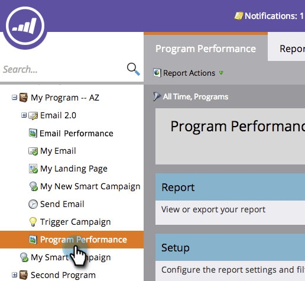

# Ajouter les colonnes d&#39;état du Programme à un rapport de Programme {#add-program-status-columns-to-a-program-report}

Ajoutez des statistiques sur l&#39;état du programme à votre [rapport de performances du programme](create-a-program-performance-report.md).

1. Accédez à Activités marketing (ou Analytics).

   

1. Sélectionnez votre rapport.

   

1. Cliquez sur l’onglet Configuration et faites glisser la souris sur la balise Canal.

   

1. Sélectionnez un canal par lequel filtrer.

   

   >[!TIP]
   >
   >Pour afficher les colonnes d&#39;état du programme, votre rapport doit être filtré par *un seul canal*.

1. Cochez l’option Afficher les colonnes d’état du programme. Cliquez sur Appliquer.

   

1. Tu l&#39;as fait ! Cliquez sur l&#39;onglet Rapport pour afficher votre rapport avec les colonnes d&#39;état du programme.

   

>[!NOTE]
>
>Si vous ne voyez pas de colonne pour chaque état dans le programme, veillez à ce que [les colonnes soient sélectionnées pour afficher](../../../../product-docs/reporting/basic-reporting/editing-reports/select-report-columns.md) dans le rapport.

>[!MORELIKETHIS]
>
>* [Filtrage d’un rapport Programme par balise](filter-a-program-report-by-tag.md)

>

>[!NOTE]
>
>**Plongée profonde**
>
>En savoir plus sur [Rapports de base](http://docs.marketo.com/display/docs/basic+reporting).

