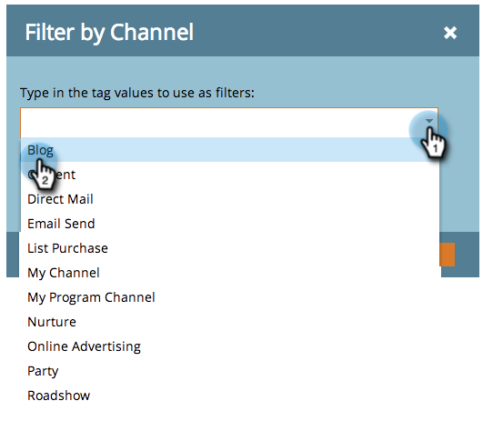

# Ajout de colonnes d’état du programme à un rapport de programme {#add-program-status-columns-to-a-program-report}

Ajoutez les statistiques relatives à l’état du programme à votre [rapport performance du programme](/help/marketo/product-docs/core-marketo-concepts/programs/program-performance-report/create-a-program-performance-report.md){target="_blank"}.

1. Accédez à **[!UICONTROL Activités marketing]** (ou **[!UICONTROL Analytics]**).

   

1. Sélectionnez votre rapport.

   

1. Cliquez sur le bouton **[!UICONTROL Configuration]** et faites glisser sur l’onglet **[!UICONTROL Canal]** balise .

   

1. Sélectionnez un canal par lequel filtrer.

   

   >[!TIP]
   >
   >Pour afficher les colonnes d’état du programme, votre rapport doit être filtré par _un seul_ canal.

1. Cochez l&#39;option Afficher les colonnes d&#39;état du programme . Cliquez sur **[!UICONTROL Appliquer]**.

   

1. Tu l&#39;as fait ! Cliquez sur le bouton [!UICONTROL Rapport] pour afficher votre rapport avec les colonnes de statut du programme.

   

>[!NOTE]
>
>Si vous ne voyez pas de colonne pour chaque état du programme, assurez-vous que vous avez [sélection des colonnes à afficher](/help/marketo/product-docs/reporting/basic-reporting/editing-reports/select-report-columns.md){target="_blank"} dans le rapport.

>[!MORELIKETHIS]
>
>[Filtrage d’un rapport de programme par balise](/help/marketo/product-docs/core-marketo-concepts/programs/program-performance-report/filter-a-program-report-by-tag.md){target="_blank"}
