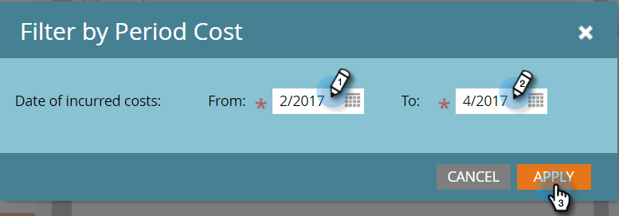

# Filtrer un rapport de programmes par coût de la période {#filter-a-program-report-by-period-cost}

Concentrez votre [rapport sur le rendement du programme](/help/marketo/product-docs/core-marketo-concepts/programs/program-performance-report/create-a-program-performance-report.md){target="_blank"} sur un échéancier de coûts pour une période précise.

1. Accédez à **[!UICONTROL Activités marketing]** (ou **[!UICONTROL Analytics]**).

   

1. Sélectionnez le rapport de performance du programme.

   

1. Cliquez sur l’onglet **[!UICONTROL Configuration]** et faites glisser sur **[!UICONTROL Coût de la période]**.

   

1. Saisissez les dates **[!UICONTROL De]** et **[!UICONTROL À]** pour les coûts engagés et cliquez sur **[!UICONTROL Appliquer]**.

   

1. C&#39;est fini ! Cliquez sur l&#39;onglet **[!UICONTROL Rapport]** pour afficher uniquement les programmes qui se situent dans le délai de coût de la période spécifiée.

   

>[!NOTE]
>
>[Filtrer un rapport de programme par programme](/help/marketo/product-docs/core-marketo-concepts/programs/program-performance-report/filter-a-program-report-by-program.md){target="_blank"}
