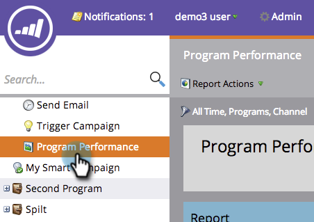

# Filtrage d’un rapport Programme par balise {#filter-a-program-report-by-tag}

Concentrez votre [rapport sur les performances](create-a-program-performance-report.md)du programme sur des [balises](http://docs.marketo.com/display/docs/tags)spécifiques.

1. Accédez à **Marketing** **Activités** (ou **Analytics**).

   

1. Sélectionnez votre rapport Performance **** Programme.

   

1. Cliquez sur l’onglet **Configuration** et faites glisser l’un des filtres **Balises** .

   

1. Sélectionnez les valeurs de balise à inclure dans votre rapport.

   

1. Cliquez sur **Appliquer**.

   

1. Fait ! Cliquez sur l&#39;onglet **Rapport** pour afficher *uniquement* les programmes qui correspondent aux balises sélectionnées dans votre rapport.

   

   >[!NOTE]
   >
   >**Articles connexes**
   >
   >    
   >    
   >    * [Filtrage d&#39;un rapport Programme par coût de période](filter-a-program-report-by-period-cost.md)

   >[!NOTE]
   >
   >**Plongée profonde**
   >
   >
   >En savoir plus sur les rapports dans le Rapports [de](http://docs.marketo.com/display/docs/basic+reporting)base.

