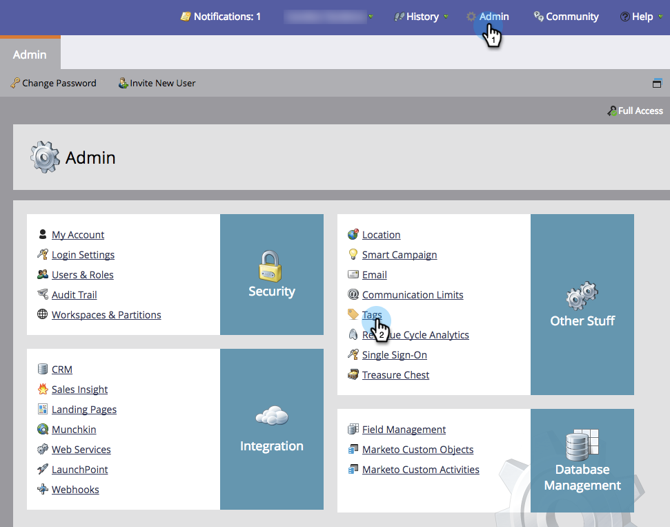
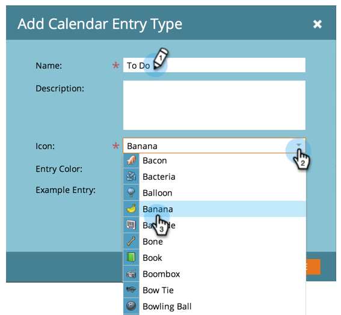
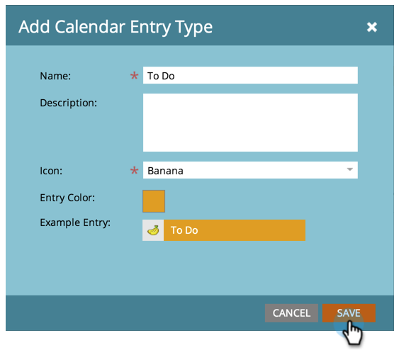

# Créer des types d’entrée personnalisés {#create-custom-entry-types}

Vous pouvez créer des types d’entrée personnalisés à utiliser dans votre Vue de Planning du programme. Cela vous permettra de suivre tous les points de l&#39;ordre du jour autres que Marketo qui affectent votre programme.

1. Accédez à la section **Admin** et cliquez sur **Balises**.

   

1. Cliquez sur Type **** d’entrée de calendrier.

   

1. Cliquez sur la liste déroulante **Nouveau** et sélectionnez Type **** d’entrée.

   

1. Nommez votre entrée et sélectionnez une icône.

   

1. Sélectionnez une couleur **** d’entrée.

   

1. Cliquez sur **Enregistrer**.

   

Super ! Maintenant, lorsque vous créez une entrée dans votre vue de planification, ce type sera une option.

>[!NOTE]
>
>Vous pouvez créer jusqu’à 100 types d’entrée personnalisés.

