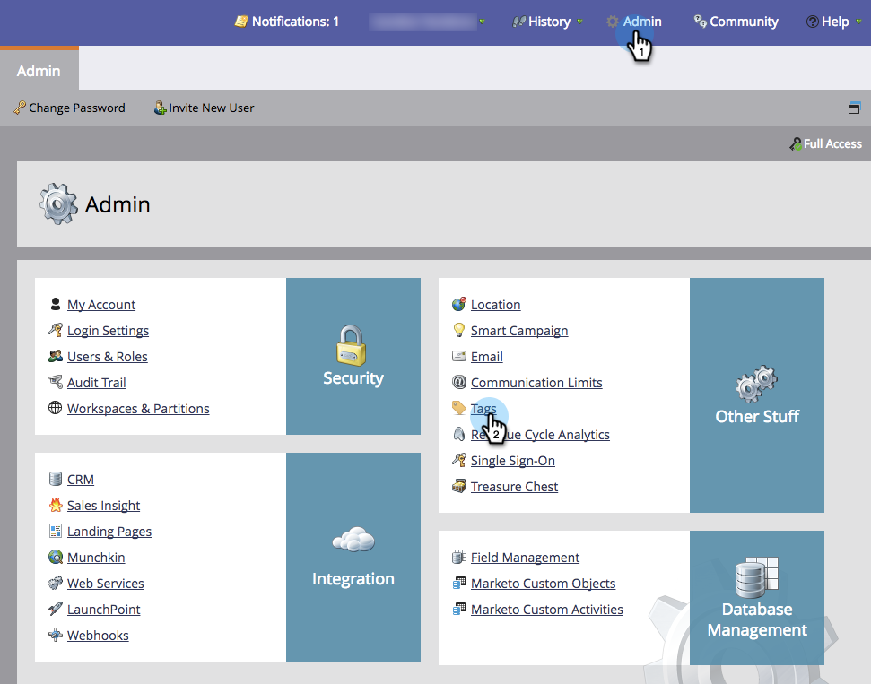

# Créer des types d’entrées personnalisés {#create-custom-entry-types}

Vous pouvez créer des types d’entrée personnalisés à utiliser dans la vue Calendrier du programme. Cela vous permettra de suivre tous les éléments de votre agenda hors Marketo qui affectent votre programme.

1. Accédez à la section **[!UICONTROL Admin]** et cliquez sur **[!UICONTROL Balises]**.

   

1. Cliquez sur **[!UICONTROL Type d’entrée de calendrier]**.

   

1. Cliquez sur la liste déroulante **[!UICONTROL Nouveau]** et sélectionnez **[!UICONTROL Type d’entrée]**.

   

1. Nommez votre entrée et sélectionnez une icône.

   

1. Sélectionnez une **[!UICONTROL Couleur d’entrée]**.

   

1. Cliquez sur **[!UICONTROL Enregistrer]**

   

Fantastique ! Désormais, lorsque vous créez une entrée dans votre vue de planning, ce type est une option.

>[!NOTE]
>
>Vous pouvez créer jusqu’à 100 types d’entrée personnalisés.
