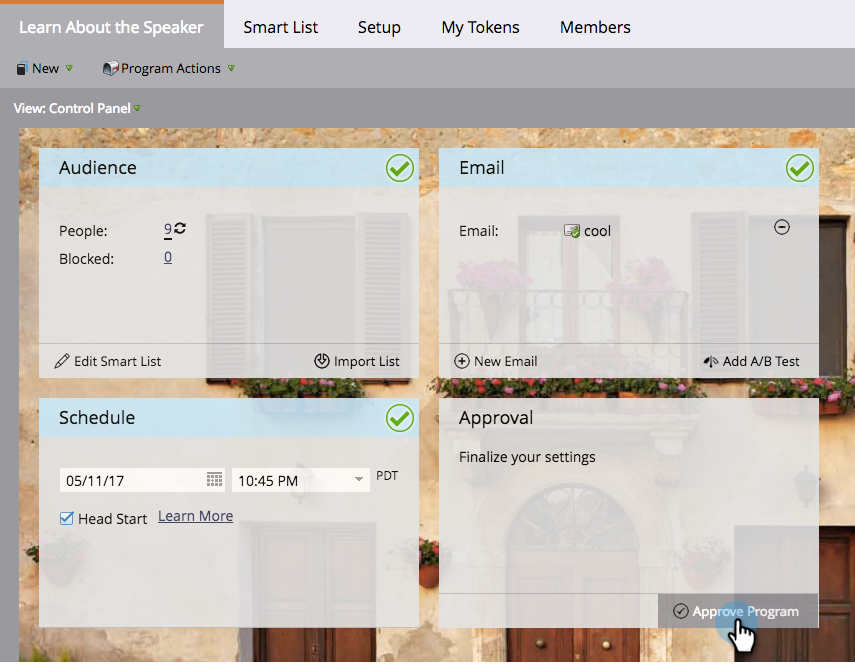

# Création d’un programme de courrier électronique en mode Planification {#creating-a-new-email-program-in-the-schedule-view}

Vous pouvez créer un programme de messagerie à partir de la vue de planification du programme. Voici comment.

1. Accédez à **[!UICONTROL Activités marketing]**.

   

1. Sélectionnez votre programme.

   

1. Sélectionnez la date d’exécution de votre programme de messagerie.

   

1. Saisissez un nom. Sélectionnez **[!UICONTROL Programme de messagerie électronique]**.

   

1. Dans les détails de l’entrée, cliquez sur le lien vers votre nouveau programme de messagerie.

   

1. [ Configurez votre programme de messagerie, puis cliquez sur **[!UICONTROL Approuver le programme]**.](/help/marketo/product-docs/email-marketing/email-programs/creating-an-email-program/create-an-email-program.md){target="_blank"}

   

   Outre le tableau de bord détaillé, l’utilisation d’un [programme d’email](/help/marketo/product-docs/email-marketing/email-programs/creating-an-email-program/understanding-email-programs.md){target="_blank"} au lieu d’une campagne dynamique présente l’avantage de pouvoir facilement mettre en oeuvre un [test A/B](/help/marketo/product-docs/email-marketing/email-programs/email-program-actions/email-test-a-b-test/add-an-a-b-test.md){target="_blank"}. Bon appétit !
