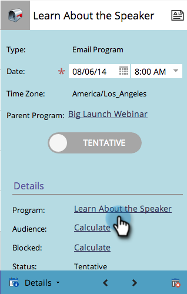

# Création d’un programme d’e-mail dans la vue Planning {#creating-a-new-email-program-in-the-schedule-view}

Vous pouvez créer un programme de messagerie à partir de la vue de planning du programme. Voici comment faire.

1. Accédez à **[!UICONTROL Activités marketing]**.

   

1. Sélectionnez votre programme.

   

1. Sélectionnez la date à laquelle vous souhaitez que votre programme de messagerie s’exécute.

   

1. Saisissez un nom. Sélectionnez **[!UICONTROL Programme de messagerie électronique]**.

   

1. Dans les détails de l’entrée, cliquez sur le lien vers votre nouveau programme de messagerie.

   

1. [Configurez votre programme de messagerie électronique](/help/marketo/product-docs/email-marketing/email-programs/creating-an-email-program/create-an-email-program.md){target="_blank"} puis cliquez sur **[!UICONTROL Approuver le programme]**.

   

   Outre le tableau de bord détaillé, un avantage à utiliser un [programme d’e-mail](/help/marketo/product-docs/email-marketing/email-programs/creating-an-email-program/understanding-email-programs.md){target="_blank"} au lieu d’une campagne intelligente est la possibilité de mettre en œuvre facilement un test [A/B](/help/marketo/product-docs/email-marketing/email-programs/email-program-actions/email-test-a-b-test/add-an-a-b-test.md){target="_blank"}. Bon appétit !
